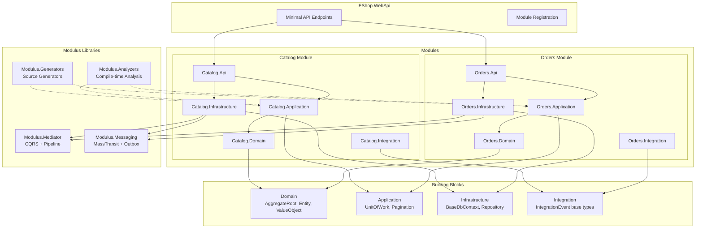

# Modulus

[](https://www.nuget.org/packages/ModulusKit.Cli)
[](https://opensource.org/licenses/MIT)
[](https://adamwyatt34.github.io/Modulus/)

A CLI tool and library suite for scaffolding .NET modular monolith solutions — with a built-in CQRS mediator, messaging with transactional outbox, and optional Aspire integration.

> **[Read the full documentation](https://adamwyatt34.github.io/Modulus/)**

## What is Modulus?

Modulus helps you build **modular monoliths** in .NET. Instead of starting with microservices, you start with a single deployable unit where each feature lives in its own module with clear boundaries. When the time comes, any module can be extracted into a standalone service.

Modulus provides:

- **A CLI tool** that scaffolds solutions, adds modules, and wires everything together
- **A lightweight CQRS mediator** with pipeline behaviors and a Result pattern (no MediatR dependency)
- **A messaging abstraction** over MassTransit with RabbitMQ, Azure Service Bus, and in-memory transports
- **A transactional outbox** for reliable cross-module event publishing
- **Optional Aspire integration** for local development orchestration

## Quick Start

### Install the CLI

```bash
dotnet tool install --global ModulusKit.Cli
```

### Create a new solution

```bash
modulus init EShop --aspire --transport rabbitmq
```

This creates a full solution with building blocks (Domain, Application, Infrastructure layers), a WebApi host, test projects, and Aspire orchestration.

### Add a module

```bash
cd EShop
modulus add-module Catalog
modulus add-module Orders
```

Each module gets its own Domain, Application, Infrastructure, Api, and Integration layers plus unit, integration, and architecture test projects.

### List modules

```bash
modulus list-modules
```

Strongly typed IDs, handler registration, and module discovery all work automatically once the packages are referenced. No additional setup is needed.

## Architecture Overview



## The Mediator

Modulus includes a custom CQRS mediator — no MediatR dependency required. It provides commands, queries, domain events, and streaming queries with a configurable pipeline.

### Commands and Queries

```csharp
// Command (no return value)
public record PlaceOrder(string CustomerId, List<OrderItem> Items) : ICommand;

// Command (with return value)
public record CreateProduct(string Name, decimal Price) : ICommand<Guid>;

// Query
public record GetOrderById(Guid Id) : IQuery<OrderDto>;
```

### Handlers

```csharp
public class PlaceOrderHandler : ICommandHandler<PlaceOrder>
{
    public async Task<Result> Handle(PlaceOrder command, CancellationToken ct)
    {
        var order = Order.Create(command.CustomerId, command.Items);
        await _repository.Add(order, ct);
        return Result.Success();
    }
}

public class GetOrderByIdHandler : IQueryHandler<GetOrderById, OrderDto>
{
    public async Task<Result<OrderDto>> Handle(GetOrderById query, CancellationToken ct)
    {
        var order = await _repository.GetById(query.Id, ct);
        if (order is null)
            return Error.NotFound("Order.NotFound", "Order was not found");

        return Result<OrderDto>.Success(order.ToDto());
    }
}
```

### Dispatching

```csharp
var result = await mediator.Send(new PlaceOrder("cust-1", items));

if (result.IsFailure)
    return Results.BadRequest(result.Errors);
```

### Pipeline Behaviors

Behaviors wrap every request in a middleware-style pipeline, executing in registration order:

```
Request → UnhandledExceptionBehavior → LoggingBehavior → ValidationBehavior → Handler → Response
```

| Behavior | Purpose |
|----------|---------|
| `UnhandledExceptionBehavior` | Catches exceptions and converts to failure Results |
| `LoggingBehavior` | Logs request timing and success/failure |
| `ValidationBehavior` | Runs FluentValidation validators, short-circuits on errors |

Register the pipeline:

```csharp
services.AddModulusMediator();
services.AddModulusHandlers(); // Auto-generated by source generator
services.AddPipelineBehavior(typeof(UnhandledExceptionBehavior<,>));
services.AddPipelineBehavior(typeof(LoggingBehavior<,>));
services.AddPipelineBehavior(typeof(ValidationBehavior<,>));
```

### The Result Pattern

Every command and query returns a `Result` or `Result<T>`, making error handling explicit and composable:

```csharp
// Error types map to HTTP status codes
Error.Validation(code, description)   // → 400 Bad Request
Error.Unauthorized(code, description) // → 401 Unauthorized
Error.Forbidden(code, description)    // → 403 Forbidden
Error.NotFound(code, description)     // → 404 Not Found
Error.Conflict(code, description)     // → 409 Conflict
Error.Failure(code, description)      // → 500 Internal Server Error
```

## Result Flow Through the Pipeline

A typical request flows through the full pipeline from HTTP request to HTTP response:

```
HTTP Request
  ↓
Minimal API Endpoint
  ↓
mediator.Send(command) / mediator.Query(query)
  ↓
┌─────────────────────────────────┐
│  UnhandledExceptionBehavior     │  ← catches exceptions → Result.Failure
│  ┌───────────────────────────┐  │
│  │  LoggingBehavior          │  │  ← logs timing + outcome
│  │  ┌─────────────────────┐  │  │
│  │  │  ValidationBehavior │  │  │  ← FluentValidation → ValidationResult (short-circuits)
│  │  │  ┌───────────────┐  │  │  │
│  │  │  │  Handler       │  │  │  │  ← business logic → Result.Success / Result.Failure
│  │  │  └───────────────┘  │  │  │
│  │  └─────────────────────┘  │  │
│  └───────────────────────────┘  │
└─────────────────────────────────┘
  ↓
UnitOfWork commit (on success)
  ↓
Result → HTTP Response
  ├── IsSuccess        → 200 OK / 201 Created
  ├── Validation error → 400 Bad Request
  ├── NotFound error   → 404 Not Found
  └── Failure error    → 500 Internal Server Error
```

## Messaging

Modulus provides a messaging abstraction over MassTransit for cross-module communication with pluggable transports.

### Publishing Integration Events

```csharp
public record OrderShipped(Guid OrderId, DateTime ShippedAt)
    : IntegrationEvent;

// Publish directly
await messageBus.Publish(new OrderShipped(orderId, DateTime.UtcNow));

// Or store in the outbox for reliable delivery
await outboxStore.Save(new OrderShipped(orderId, DateTime.UtcNow));
```

### Handling Events

```csharp
public class OrderShippedHandler : IIntegrationEventHandler<OrderShipped>
{
    public async Task Handle(OrderShipped @event, CancellationToken ct)
    {
        // React to the event in another module
    }
}
```

### Switching Transports

Configure the transport at startup — no handler code changes required:

```csharp
services.AddModulusMessaging(options =>
{
    options.Transport = Transport.RabbitMq;        // or InMemory, AzureServiceBus
    options.ConnectionString = "amqp://localhost";
    options.Assemblies.Add(typeof(Program).Assembly);
});
```

### Transactional Outbox

The outbox pattern ensures events are published reliably even if the message broker is temporarily unavailable. Events are stored in your database within the same transaction as your business data, then a background processor publishes them:

1. Handler saves business data + outbox event in one transaction
2. `OutboxProcessor` polls for pending events (default: every 5 seconds)
3. Events are published via MassTransit and marked as processed

## Aspire Integration

Pass `--aspire` when initializing to include .NET Aspire projects:

```bash
modulus init EShop --aspire
```

This adds an `AppHost` and `ServiceDefaults` project. The WebApi host automatically registers service defaults and health check endpoints.

## Source Generators

Modulus includes Roslyn incremental source generators that eliminate boilerplate and replace runtime reflection with compile-time code generation.

### Strongly Typed IDs

Annotate a `readonly partial record struct` with `[StronglyTypedId]` to generate a complete value type with EF Core, JSON, and model binding support:

```csharp
[StronglyTypedId]
public readonly partial record struct OrderId;

[StronglyTypedId(typeof(int))]
public readonly partial record struct SequenceNumber;
```

The generator produces:
- Value property, constructor, `New()` factory (Guid-backed), and `Empty`
- **EF Core `ValueConverter`** for database persistence
- **System.Text.Json `JsonConverter`** for API serialization
- **`TypeConverter`** for minimal API route parameter binding

Supported backing types: `Guid` (default), `int`, `long`.

### Handler & Validator Registration

A source generator discovers all handler and validator types at compile time and produces an `AddModulusHandlers()` extension method with explicit registrations -- no Scrutor, no reflection:

```csharp
// In your module's ConfigureServices:
services.AddModulusMediator();
services.AddModulusHandlers(); // Source-generated — registers all handlers and validators
```

Discovered types: `ICommandHandler<>`, `IQueryHandler<>`, `IStreamQueryHandler<>`, `IDomainEventHandler<>`, `IIntegrationEventHandler<>`, and `AbstractValidator<>`.

### Module Auto-Discovery

A source generator scans referenced assemblies for `IModuleRegistration` implementations and produces `AddAllModules()` and `MapAllModuleEndpoints()` methods:

```csharp
// In Program.cs:
builder.Services.AddAllModules(builder.Configuration);
app.MapAllModuleEndpoints();
```

Control initialization order with the `[ModuleOrder]` attribute:

```csharp
[ModuleOrder(1)]
public class CatalogModule : IModuleRegistration { /* ... */ }
```

This eliminates the manual `ModuleRegistration.cs` file and simplifies the `modulus add-module` CLI command -- adding a module no longer requires modifying the composition root.

## Roslyn Analyzers

Modulus ships with five Roslyn analyzers that enforce modular architecture conventions directly in your IDE:

| Rule | Severity | Description |
|------|----------|-------------|
| MOD001 | Error | Module boundary violation -- cross-module reference to non-Integration project |
| MOD002 | Warning | Handler not returning `Result` or `Result<T>` |
| MOD003 | Warning | Throwing exceptions for expected errors in handlers instead of returning `Error` |
| MOD004 | Warning | Infrastructure attributes (EF, JSON) in Domain layer |
| MOD005 | Info | Public setter on entity property |

Code fixes are available for MOD003 (converts `throw` to `return Error`) and MOD005 (adds `private` to setter). Suppress rules with `#pragma warning disable` or `.editorconfig`.

Analyzers complement the NetArchTest architecture tests -- analyzers give real-time IDE feedback as you type, while architecture tests provide a CI safety net.

## Module Structure

Each module follows a clean architecture layout:

```
src/Modules/Catalog/
├── src/
│   ├── Catalog.Api/                  # Minimal API endpoints
│   ├── Catalog.Application/         # Commands, queries, handlers, validators
│   ├── Catalog.Domain/              # Entities, value objects, domain events
│   ├── Catalog.Infrastructure/      # DbContext, repositories, module registration
│   └── Catalog.Integration/         # Integration events shared with other modules
└── tests/
    ├── Catalog.Tests.Unit/
    ├── Catalog.Tests.Integration/
    └── Catalog.Tests.Architecture/
```

Modules communicate with each other **only** through integration events — never by direct project references.

## Extracting a Module to a Microservice

Because modules have clear boundaries, extracting one to a standalone service is straightforward:

1. **Create a new WebApi host** for the module
2. **Move the module projects** (Api, Application, Domain, Infrastructure) to the new solution
3. **Switch the transport** from `InMemory` to `RabbitMq` or `AzureServiceBus` in both solutions
4. **Update the outbox** to publish events over the real transport
5. **Remove the module** from the monolith solution

No handler or business logic changes are needed — the mediator and messaging abstractions remain the same.

## Packages

| Package | Description |
|---------|-------------|
| [`ModulusKit.Cli`](https://www.nuget.org/packages/ModulusKit.Cli) | CLI tool for scaffolding modular monolith solutions |
| [`ModulusKit.Mediator`](https://www.nuget.org/packages/ModulusKit.Mediator) | CQRS mediator with pipeline behaviors and Result pattern |
| [`ModulusKit.Mediator.Abstractions`](https://www.nuget.org/packages/ModulusKit.Mediator.Abstractions) | Mediator interfaces, Result types, and pipeline contracts |
| [`ModulusKit.Messaging`](https://www.nuget.org/packages/ModulusKit.Messaging) | MassTransit messaging with multi-transport and outbox support |
| [`ModulusKit.Messaging.Abstractions`](https://www.nuget.org/packages/ModulusKit.Messaging.Abstractions) | Messaging interfaces and integration event contracts |
| [`ModulusKit.Generators`](https://www.nuget.org/packages/ModulusKit.Generators) | Source generators for strongly typed IDs, handler registration, and module discovery |
| [`ModulusKit.Analyzers`](https://www.nuget.org/packages/ModulusKit.Analyzers) | Roslyn analyzers enforcing modular architecture conventions |

Both `ModulusKit.Generators` and `ModulusKit.Analyzers` are transitively included through `ModulusKit.Mediator.Abstractions`.

## Contributing

Contributions are welcome! Please open an issue or pull request on [GitHub](https://github.com/adamwyatt34/Modulus).

1. Fork the repository
2. Create a feature branch (`git checkout -b feature/my-feature`)
3. Make your changes and add tests
4. Run the test suite (`dotnet test`)
5. Submit a pull request

## License

This project is licensed under the [MIT License](https://opensource.org/licenses/MIT).
