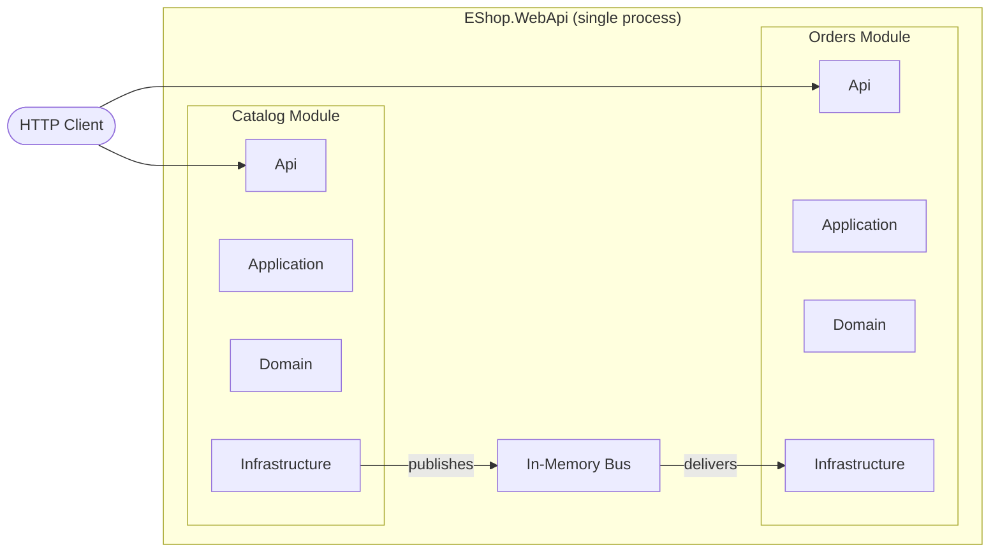
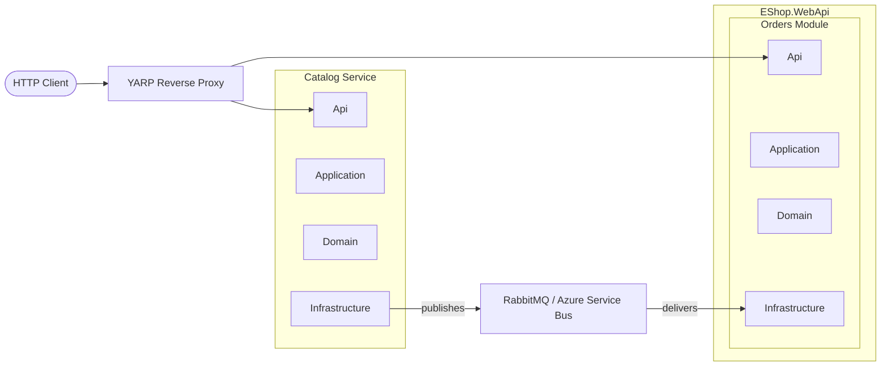

# Extracting to Microservices

A Modulus modular monolith is designed so that any module can be extracted into its own independently deployable service when the need arises. Because modules are already isolated -- separate schemas, no cross-module references beyond Integration events, and all communication through the message bus -- the extraction process is mechanical rather than architectural.

## Why This Path Works

The hard part of extracting a microservice from a monolith is usually untangling shared state, direct method calls, and implicit dependencies. In a Modulus solution, these problems do not exist:

- **No shared database tables** -- Each module uses its own schema.
- **No cross-module method calls** -- Modules communicate exclusively through integration events.
- **No shared domain models** -- Each module owns its own entities and value objects.
- **Transport-agnostic messaging** -- Switching from in-memory to RabbitMQ or Azure Service Bus is a configuration change, not a code change.
- **Self-contained DI** -- Each module registers its own services through `IModuleRegistration`.

::: tip Extract only when you have a reason
Do not extract a module just because you can. Valid reasons include: the module needs independent scaling, a separate team owns it, it needs a different deployment cadence, or it requires different infrastructure (e.g., a different database engine). If none of these apply, the monolith is the simpler and better choice.
:::

## Before Extraction

In the monolith, all modules run in the same process. Integration events flow through the in-memory transport, and the host composes all modules at startup.



## After Extraction

The Catalog module runs as its own service. Integration events now flow through a real message broker, and an optional reverse proxy routes HTTP requests to the correct service.



## Step-by-Step Extraction

### 1. Create a New Host

Create a new WebApi project for the extracted module. This becomes the module's own deployable service.

```bash
dotnet new web -n EShop.Catalog.WebApi -o src/EShop.Catalog.WebApi
```

Set up `Program.cs` with the same module registration pattern used in the monolith:

```csharp
var builder = WebApplication.CreateBuilder(args);

// Register the Catalog module
var catalogModule = new CatalogModuleRegistration();
catalogModule.ConfigureServices(builder.Services, builder.Configuration);

// Register mediator, messaging, etc.
builder.Services.AddModulusMediator(typeof(CatalogModuleRegistration).Assembly);
builder.Services.AddModulusMessaging(builder.Configuration);

var app = builder.Build();

catalogModule.ConfigureEndpoints(app);

app.Run();
```

### 2. Move the Module Projects

Move (or reference) the four module projects into the new service's solution:

- `EShop.Modules.Catalog.Api`
- `EShop.Modules.Catalog.Application`
- `EShop.Modules.Catalog.Domain`
- `EShop.Modules.Catalog.Infrastructure`

The Integration project (`EShop.Modules.Catalog.Integration`) stays shared -- both solutions reference it so that the monolith can still consume the Catalog module's events.

```
EShop.Catalog/                           # New solution
├── EShop.Catalog.slnx
├── src/
│   ├── EShop.Catalog.WebApi/            # New host
│   ├── Modules/Catalog/                 # Moved from monolith
│   │   ├── EShop.Modules.Catalog.Api/
│   │   ├── EShop.Modules.Catalog.Application/
│   │   ├── EShop.Modules.Catalog.Domain/
│   │   └── EShop.Modules.Catalog.Infrastructure/
│   └── BuildingBlocks/                  # Shared via NuGet or project reference
└── shared/
    └── EShop.Modules.Catalog.Integration/  # Referenced by both solutions
```

### 3. Switch the Transport

In both solutions, update the messaging configuration to use a real message broker instead of the in-memory transport.

**Catalog Service** (`appsettings.json`):

```json
{
  "Messaging": {
    "Transport": "RabbitMq",
    "RabbitMq": {
      "Host": "rabbitmq://localhost",
      "Username": "guest",
      "Password": "guest"
    }
  }
}
```

**Monolith** (`appsettings.json`):

```json
{
  "Messaging": {
    "Transport": "RabbitMq",
    "RabbitMq": {
      "Host": "rabbitmq://localhost",
      "Username": "guest",
      "Password": "guest"
    }
  }
}
```

::: info Azure Service Bus
If your environment uses Azure, set `"Transport": "AzureServiceBus"` and provide the connection string instead. The business logic and event contracts remain identical regardless of the transport.
:::

### 4. Update the Outbox

The outbox already persists integration events to the database before publishing. The only change is that the outbox publisher now sends events over the real transport instead of in-memory. This is handled automatically by `Modulus.Messaging` based on the transport configuration -- no code changes are needed.

### 5. Remove the Module from the Monolith

Remove the Catalog module projects from the monolith solution and delete the module registration from the host's composition root. The monolith no longer serves Catalog endpoints directly.

```bash
# Remove project references from the monolith solution
dotnet sln EShop.slnx remove src/Modules/Catalog/EShop.Modules.Catalog.Api
dotnet sln EShop.slnx remove src/Modules/Catalog/EShop.Modules.Catalog.Application
dotnet sln EShop.slnx remove src/Modules/Catalog/EShop.Modules.Catalog.Domain
dotnet sln EShop.slnx remove src/Modules/Catalog/EShop.Modules.Catalog.Infrastructure
```

Keep the reference to `EShop.Modules.Catalog.Integration` so the remaining modules can still consume Catalog events.

## What Changes vs. What Stays the Same

| Aspect | Changes | Stays the Same |
|---|---|---|
| **Hosting** | Module runs in its own WebApi process | `IModuleRegistration`, `ConfigureServices`, `ConfigureEndpoints` |
| **Transport** | In-memory replaced with RabbitMQ or Azure Service Bus | Integration event contracts, outbox pattern |
| **Routing** | YARP proxy routes requests to the new service | Endpoint definitions, route paths |
| **Database** | May move to a separate database server | Schema name, EF configurations, repositories |
| **Business logic** | Nothing | Commands, queries, handlers, domain entities, validators |

::: tip The business logic is untouched
The entire Domain and Application layers transfer without modification. Every command, query, handler, entity, value object, and validator works exactly as it did in the monolith.
:::

## Considerations

### Database Migration

If both the monolith and the extracted service share the same database server, the module's schema is already isolated. You can run both services against the same database initially and split the database later when needed.

If you need a separate database from the start:

1. Create a new database for the extracted service.
2. Run the module's EF Core migrations against the new database.
3. Migrate data from the old schema to the new database.
4. Update the connection string in the new service's configuration.

### YARP Reverse Proxy

To keep existing clients unaware of the extraction, add a [YARP](https://microsoft.github.io/reverse-proxy/) reverse proxy in front of both services. The proxy routes requests based on URL prefix.

```csharp
// In the monolith's Program.cs (or a dedicated gateway)
builder.Services.AddReverseProxy()
    .LoadFromConfig(builder.Configuration.GetSection("ReverseProxy"));

var app = builder.Build();
app.MapReverseProxy();
app.Run();
```

```json
{
  "ReverseProxy": {
    "Routes": {
      "catalog-route": {
        "ClusterId": "catalog-cluster",
        "Match": {
          "Path": "/catalog/{**catch-all}"
        }
      },
      "monolith-route": {
        "ClusterId": "monolith-cluster",
        "Match": {
          "Path": "/{**catch-all}"
        }
      }
    },
    "Clusters": {
      "catalog-cluster": {
        "Destinations": {
          "destination1": {
            "Address": "https://localhost:5002/"
          }
        }
      },
      "monolith-cluster": {
        "Destinations": {
          "destination1": {
            "Address": "https://localhost:5001/"
          }
        }
      }
    }
  }
}
```

### Service Discovery

If you are using [.NET Aspire](/aspire/), service discovery between the monolith and extracted services is handled automatically through the Aspire AppHost. Add both projects to the AppHost and reference them:

```csharp
var builder = DistributedApplication.CreateBuilder(args);

var catalogService = builder.AddProject<Projects.EShop_Catalog_WebApi>("catalog");
var monolith = builder.AddProject<Projects.EShop_WebApi>("webapi");

builder.Build().Run();
```

Aspire provides DNS-based service discovery, distributed tracing across both services, and a unified health check dashboard.

## See Also

- [Architecture Overview](./) -- Module isolation and how it enables extraction
- [Messaging](/messaging/) -- Integration events and transport configuration
- [Transports](/messaging/transports) -- In-memory, RabbitMQ, and Azure Service Bus setup
- [Aspire Integration](/aspire/) -- Orchestrating multiple services with .NET Aspire
