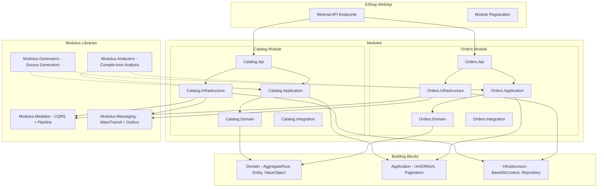
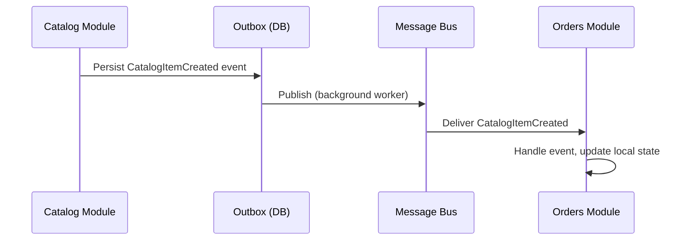

# Modular Monolith Overview

A modular monolith is a single deployable application that is internally decomposed into highly isolated feature modules. Each module owns its domain, data, and business logic, communicating with other modules only through well-defined integration events. Modulus scaffolds this architecture from day one so that you get the simplicity of a monolith with the structural discipline of microservices.

## Why a Modular Monolith?

Microservices solve real problems -- independent deployability, polyglot persistence, per-service scaling -- but they introduce equally real complexity: distributed transactions, network latency, eventual consistency, and a heavy operational burden. For most teams, that complexity arrives long before the benefits become relevant.

A modular monolith gives you the structural benefits without the distributed systems tax:

| Concern | Modular Monolith | Microservices |
|---|---|---|
| **Deployment** | Single artifact | Many artifacts, orchestration required |
| **Module isolation** | Enforced by architecture tests and schema separation | Enforced by network boundaries |
| **Cross-module communication** | In-memory integration events (same process) | Network calls, serialization, retries |
| **Transactions** | Standard database transactions within a module | Distributed transactions or sagas |
| **Refactoring** | Rename and move within one solution | Coordinated changes across repositories |
| **Operational overhead** | One process to monitor | Service mesh, observability per service |

::: tip Start monolith, extract later
The Modulus architecture is designed so that any module can be extracted into its own microservice when the need arises. You get isolation guarantees today and a clean extraction path tomorrow. See [Extracting to Microservices](./extraction) for the step-by-step process.
:::

## When to Choose a Modular Monolith

**Choose a modular monolith when:**

- Your team is small to medium and owns the entire product.
- You value fast iteration and simple deployments.
- You want clear module boundaries without distributed systems complexity.
- You are not yet sure where the service boundaries should be drawn.

**Consider microservices when:**

- Independent teams need to deploy on different cadences.
- Individual modules have dramatically different scaling requirements.
- You need polyglot persistence or technology diversity.
- You have the operational maturity to manage distributed infrastructure.

## Solution Structure

A Modulus-generated solution follows a consistent layout. The host web API composes all modules, each module is self-contained with five layers, and shared building blocks provide base types used across modules.



### Key Structural Decisions

- **Single host** -- `EShop.WebApi` is the only runnable project. It discovers and registers all modules at startup through the `IModuleRegistration` interface.
- **Five layers per module** -- Domain, Application, Infrastructure, Api, and Integration. Each layer has strict dependency rules enforced by architecture tests.
- **Building blocks** -- Shared base classes (`Entity<TId>`, `AggregateRoot<TId>`, `ValueObject`, `BaseDbContext`, etc.) live in a `BuildingBlocks` folder and are referenced by all modules.
- **Modulus libraries** -- `Modulus.Mediator` provides in-process CQRS dispatch. `Modulus.Messaging` provides integration event publishing and consumption via MassTransit. `Modulus.Generators` provides compile-time source generators for handler registration, module discovery, and strongly typed IDs. `Modulus.Analyzers` enforces architectural conventions directly in the IDE.

## How Modules Stay Isolated

Module isolation is not a convention -- it is enforced at multiple levels:

### 1. Schema Separation

Each module owns its own database schema. The module's `DbContext` is configured to use a dedicated schema name (e.g., `catalog`, `orders`), preventing any module from directly querying another module's tables.

```csharp
protected override void OnModelCreating(ModelBuilder modelBuilder)
{
    modelBuilder.HasDefaultSchema("catalog");
    // ...
}
```

### 2. Integration-Only Cross-References

Modules never reference each other's Domain, Application, Infrastructure, or Api projects. The only project a module may reference from another module is its **Integration** project, which contains nothing but integration event record types.

```
// Allowed
Orders.Infrastructure --> Catalog.Integration (to consume CatalogItemCreated event)

// Forbidden
Orders.Application --> Catalog.Domain
Orders.Infrastructure --> Catalog.Infrastructure
```

### 3. Architecture Tests

Every module includes a dedicated architecture test project that uses [NetArchTest](https://github.com/BenMorris/NetArchTest) to verify layer dependency rules at build time. If a developer accidentally adds a reference from Domain to Infrastructure, the test fails.

```csharp
[Fact]
public void Domain_Should_Not_Reference_Infrastructure()
{
    var result = Types.InAssembly(DomainAssembly)
        .ShouldNot()
        .HaveDependencyOn("EShop.Modules.Catalog.Infrastructure")
        .GetResult();

    result.IsSuccessful.Should().BeTrue();
}
```

See [Architecture Tests](/testing/architecture-tests) for the full set of enforced rules.

### 4. Communication via Integration Events Only

Modules communicate asynchronously through integration events. A domain event within one module triggers an integration event that is published through the outbox and consumed by other modules. There are no synchronous cross-module calls.



### 5. Roslyn Analyzers

In addition to architecture tests that run in CI, Modulus includes Roslyn analyzers that provide **real-time feedback directly in your IDE** as you type. The `MOD001` analyzer specifically enforces module boundaries -- if a developer references a type from another module's Domain, Application, Infrastructure, or Api project, the IDE immediately shows an error.

This creates two complementary layers of protection:

| Layer | When | Tool | Scope |
|---|---|---|---|
| **Analyzers** | Real-time in IDE | Roslyn (MOD001--MOD005) | Individual file analysis |
| **Architecture Tests** | CI / `dotnet test` | NetArchTest | Full assembly analysis |

Analyzers catch violations the moment code is written. Architecture tests provide a broader CI safety net for rules that are difficult to express as single-file analyzers. Together, they make it nearly impossible for boundary violations to reach production.

See [Analyzers](/analyzers/) for the full rule reference and configuration guide.

::: info In-memory transport in monolith mode
When running as a monolith, the message bus uses an in-memory transport. Events are still published through the outbox for consistency, but delivery happens within the same process. When you extract a module, you switch the transport to RabbitMQ or Azure Service Bus -- no business logic changes.
:::

## What's Next

Explore the architecture in detail:

- **[Module Anatomy](./module-anatomy)** -- The five layers, their responsibilities, and dependency rules
- **[Building Blocks](./building-blocks)** -- Base classes and shared infrastructure
- **[Extracting to Microservices](./extraction)** -- Step-by-step guide for breaking out a module
- **[Mediator](/mediator/)** -- In-process CQRS dispatch and pipeline behaviors
- **[Messaging](/messaging/)** -- Integration events, transports, and the outbox pattern
