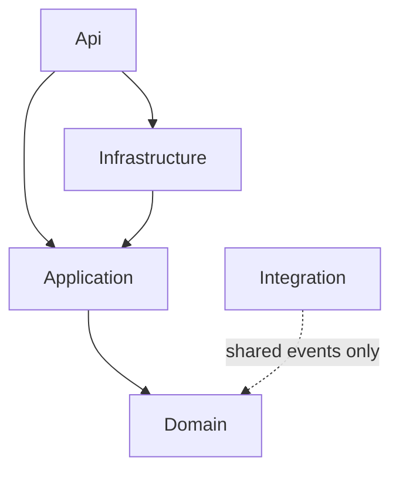

# Module Anatomy

Every module generated by Modulus follows the same five-layer structure with three dedicated test projects. This consistency makes it easy to navigate any module in the solution, onboard new team members, and enforce architectural rules automatically.

## Directory Structure

When you run `modulus add-module Catalog`, the following structure is generated:

```
src/Modules/Catalog/
├── EShop.Modules.Catalog.Api/
│   ├── Endpoints/
│   │   └── ProductEndpoints.cs
│   └── CatalogModuleRegistration.cs
├── EShop.Modules.Catalog.Application/
│   ├── Products/
│   │   ├── Commands/
│   │   │   └── CreateProduct/
│   │   │       ├── CreateProduct.cs
│   │   │       ├── CreateProductHandler.cs
│   │   │       └── CreateProductValidator.cs
│   │   └── Queries/
│   │       └── GetProductById/
│   │           ├── GetProductById.cs
│   │           ├── GetProductByIdHandler.cs
│   │           └── ProductDto.cs
│   └── Contracts/
│       ├── IProductRepository.cs
│       └── IQueryDb.cs
├── EShop.Modules.Catalog.Domain/
│   ├── Products/
│   │   ├── Product.cs
│   │   ├── ProductName.cs          # value object
│   │   └── Events/
│   │       └── ProductCreatedEvent.cs
│   └── Exceptions/
│       └── InvalidProductException.cs
├── EShop.Modules.Catalog.Infrastructure/
│   ├── Data/
│   │   ├── CatalogDbContext.cs
│   │   ├── CatalogQueryDb.cs
│   │   └── Configurations/
│   │       └── ProductConfiguration.cs
│   ├── Repositories/
│   │   └── ProductRepository.cs
│   └── CatalogModuleRegistration.cs
└── EShop.Modules.Catalog.Integration/
    └── Events/
        └── CatalogItemCreatedEvent.cs

tests/Modules/Catalog/
├── EShop.Modules.Catalog.Tests.Unit/
├── EShop.Modules.Catalog.Tests.Integration/
└── EShop.Modules.Catalog.Tests.Architecture/
```

## Layer Dependency Rules

Each layer has strict rules about what it can and cannot reference. These rules are enforced by [architecture tests](/testing/architecture-tests) and by project reference constraints.



The arrows represent allowed project references. Any reference not shown in this diagram is forbidden and will cause an architecture test failure.

| Layer | Can Reference | Cannot Reference |
|---|---|---|
| **Domain** | BuildingBlocks.Domain | Application, Infrastructure, Api, Integration, any other module |
| **Application** | Domain, BuildingBlocks.Application | Infrastructure, Api, Integration, any other module |
| **Infrastructure** | Application, BuildingBlocks.Infrastructure, Modulus packages | Domain (direct), Api, any other module (except Integration) |
| **Api** | Application, Infrastructure | Domain (direct), any other module |
| **Integration** | BuildingBlocks.Domain (event base types) | Application, Infrastructure, Api |

::: warning Infrastructure references Application, not Domain directly
Infrastructure depends on Application (which transitively includes Domain). Infrastructure should not add a direct project reference to Domain. This keeps the dependency chain clean and ensures all domain access flows through Application-layer abstractions.
:::

## Layer Details

### Domain

The Domain layer is the core of the module. It contains the business rules, entities, and domain events. It has **zero** framework dependencies -- no EF Core, no ASP.NET, no MassTransit.

**Contains:**

- **Entities** -- Classes extending `Entity<TId>` that represent domain objects with identity.
- **Aggregate roots** -- Classes extending `AggregateRoot<TId>` that serve as consistency boundaries. Only aggregate roots can raise domain events.
- **Value objects** -- Classes extending `ValueObject` with equality defined by their properties, not identity.
- **Domain events** -- Records implementing `IDomainEvent` that represent something meaningful that happened within the domain.
- **Domain exceptions** -- Custom exceptions extending `DomainException` for invariant violations.

```csharp
public class Product : AggregateRoot<Guid>
{
    public ProductName Name { get; private set; }
    public decimal Price { get; private set; }

    private Product() { } // EF Core

    public static Product Create(string name, decimal price)
    {
        var product = new Product
        {
            Id = Guid.NewGuid(),
            Name = ProductName.Create(name),
            Price = price
        };

        product.RaiseDomainEvent(new ProductCreatedEvent(product.Id));

        return product;
    }
}
```

::: tip Keep the Domain pure
The Domain layer should express business rules in plain C# with no dependencies on frameworks or infrastructure concerns. This makes it easy to unit test and resilient to technology changes.
:::

### Application

The Application layer orchestrates use cases. It defines the commands, queries, and their handlers that drive the module's behavior. It depends on the Domain layer for entities and business rules but knows nothing about how data is persisted or how HTTP requests arrive.

**Contains:**

- **Commands** -- Records implementing `ICommand` or `ICommand<TResult>` that represent intent to change state.
- **Queries** -- Records implementing `IQuery<TResult>` that represent intent to read state.
- **Handlers** -- Classes implementing `ICommandHandler` or `IQueryHandler` that contain use-case logic.
- **Validators** -- FluentValidation validators for commands and queries, executed automatically by the validation pipeline behavior.
- **DTOs** -- Data transfer objects returned by queries. DTOs are simple records with no behavior.
- **Interfaces** -- `IUnitOfWork` for transaction management, `IQueryDb` for read-only database access, and custom repository interfaces.

```csharp
// Command
public sealed record CreateProduct(string Name, decimal Price) : ICommand<Guid>;

// Validator
public sealed class CreateProductValidator : AbstractValidator<CreateProduct>
{
    public CreateProductValidator()
    {
        RuleFor(x => x.Name).NotEmpty().MaximumLength(200);
        RuleFor(x => x.Price).GreaterThan(0);
    }
}

// Handler
public sealed class CreateProductHandler : ICommandHandler<CreateProduct, Guid>
{
    private readonly IRepository<Product> _repository;
    private readonly IUnitOfWork _unitOfWork;

    public CreateProductHandler(IRepository<Product> repository, IUnitOfWork unitOfWork)
    {
        _repository = repository;
        _unitOfWork = unitOfWork;
    }

    public async Task<Result<Guid>> Handle(
        CreateProduct command,
        CancellationToken cancellationToken)
    {
        var product = Product.Create(command.Name, command.Price);
        await _repository.AddAsync(product, cancellationToken);
        await _unitOfWork.CommitAsync(cancellationToken);
        return Result<Guid>.Success(product.Id);
    }
}
```

### Infrastructure

The Infrastructure layer provides concrete implementations for the abstractions defined in Application and Domain. It is the only layer that knows about EF Core, external services, and the messaging framework.

**Contains:**

- **DbContext** -- A module-specific `DbContext` extending `BaseDbContext`, configured with its own schema.
- **Entity configurations** -- EF Core `IEntityTypeConfiguration<T>` classes for mapping entities to tables.
- **Repositories** -- Concrete implementations of repository interfaces, typically extending `EfRepository<T>`.
- **Module registration** -- The `IModuleRegistration` implementation that registers all module services into the DI container and maps endpoints.
- **External service clients** -- HTTP clients, third-party SDK wrappers, and other infrastructure concerns.

```csharp
public class CatalogDbContext : BaseDbContext
{
    public DbSet<Product> Products => Set<Product>();

    public CatalogDbContext(DbContextOptions<CatalogDbContext> options)
        : base(options) { }

    protected override void OnModelCreating(ModelBuilder modelBuilder)
    {
        modelBuilder.HasDefaultSchema("catalog");
        modelBuilder.ApplyConfigurationsFromAssembly(
            typeof(CatalogDbContext).Assembly);
        base.OnModelCreating(modelBuilder);
    }
}
```

### Api

The Api layer defines the module's HTTP surface. It contains minimal API endpoint definitions and the module's route registration logic. The Api layer is thin -- it delegates all business logic to the Application layer through the mediator.

**Contains:**

- **Endpoints** -- Classes implementing the `IEndpoint` interface, each defining a single HTTP endpoint.
- **Route groups** -- Logical groupings of endpoints under a shared prefix (e.g., `/catalog`).

```csharp
public class CreateProductEndpoint : IEndpoint
{
    public void MapEndpoint(IEndpointRouteBuilder app)
    {
        app.MapPost("/catalog", async (
            CreateProduct command,
            IMediator mediator,
            CancellationToken ct) =>
        {
            var result = await mediator.Send(command, ct);

            return result.Match(
                onSuccess: id => Results.Created($"/catalog/{id}", id),
                onFailure: errors => Results.BadRequest(errors));
        })
        .WithName("CreateProduct")
        .WithTags("Catalog")
        .Produces<Guid>(StatusCodes.Status201Created)
        .ProducesValidationProblem();
    }
}
```

### Integration

The Integration layer is the module's public contract. It contains **only** integration event record types -- no handlers, no logic, no services. Other modules reference this project to consume events published by this module.

**Contains:**

- **Integration events** -- Simple record types that describe cross-module occurrences.

```csharp
public sealed record CatalogItemCreatedEvent(
    Guid ProductId,
    string Name,
    decimal Price) : IIntegrationEvent;
```

::: warning Integration events are contracts
Treat integration events like a public API. Changing an event's shape is a breaking change for all consuming modules. Add new properties as optional (nullable or with defaults) and avoid removing existing properties.
:::

## Module Registration

Each module has a registration class that implements `IModuleRegistration`. The host project calls these at startup to compose all modules into a single application.

```csharp
public class CatalogModuleRegistration : IModuleRegistration
{
    public void ConfigureServices(IServiceCollection services, IConfiguration configuration)
    {
        // Register module-specific DbContext
        services.AddDbContext<CatalogDbContext>(options =>
            options.UseNpgsql(configuration.GetConnectionString("Database")));

        // Register repositories
        services.AddScoped<IRepository<Product>, EfRepository<Product>>();

        // Register IUnitOfWork scoped to this module's DbContext
        services.AddScoped<IUnitOfWork>(sp =>
            sp.GetRequiredService<CatalogDbContext>());

        // Register FluentValidation validators
        services.AddValidatorsFromAssembly(typeof(CatalogModuleRegistration).Assembly);
    }

    public void ConfigureEndpoints(IEndpointRouteBuilder app)
    {
        // Discover and map all IEndpoint implementations in this module
        var endpoints = typeof(CatalogModuleRegistration).Assembly
            .GetTypes()
            .Where(t => typeof(IEndpoint).IsAssignableFrom(t) && !t.IsAbstract)
            .Select(Activator.CreateInstance)
            .Cast<IEndpoint>();

        foreach (var endpoint in endpoints)
        {
            endpoint.MapEndpoint(app);
        }
    }
}
```

The host's `Program.cs` discovers and invokes all module registrations:

```csharp
var builder = WebApplication.CreateBuilder(args);

// Discover all IModuleRegistration implementations
var registrations = DiscoverModuleRegistrations();

foreach (var registration in registrations)
{
    registration.ConfigureServices(builder.Services, builder.Configuration);
}

var app = builder.Build();

foreach (var registration in registrations)
{
    registration.ConfigureEndpoints(app);
}

app.Run();
```

## Module Isolation Rules

The following rules are enforced by architecture tests using NetArchTest. Every module's `Tests.Architecture` project verifies these constraints:

1. **Domain has no outward dependencies** -- Domain must not reference Application, Infrastructure, Api, or any other module.
2. **Application does not reference Infrastructure** -- Application defines interfaces; Infrastructure implements them.
3. **No cross-module references** -- A module must not reference another module's Domain, Application, Infrastructure, or Api projects. Only Integration projects may be referenced.
4. **Integration contains only event types** -- Integration projects must not contain handlers, services, or any logic.
5. **Domain events stay internal** -- `IDomainEvent` implementations are internal to the module. Cross-module communication uses `IIntegrationEvent` types from the Integration project.

::: info Learn more
See [Architecture Tests](/testing/architecture-tests) for the complete test suite and how to customize the rules for your project.
:::

## See Also

- [Building Blocks](./building-blocks) -- Base classes shared across all modules
- [Extracting to Microservices](./extraction) -- How to break a module out of the monolith
- [Mediator](/mediator/) -- CQRS dispatch and pipeline behaviors
- [Messaging](/messaging/) -- Integration events and transport configuration
