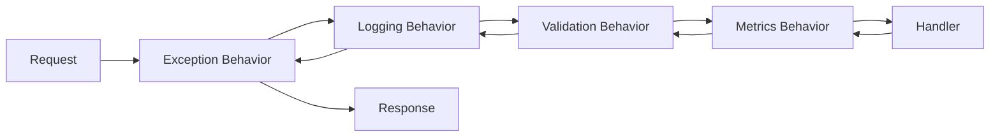

# Pipeline Behaviors

Pipeline behaviors wrap command and query handlers with cross-cutting concerns like validation, logging, exception handling, and metrics. They form a nested middleware pipeline that executes around every request dispatched through `IMediator.Send()` and `IMediator.Query()`.

## How the Pipeline Works

### IPipelineBehavior Interface

Every pipeline behavior implements `IPipelineBehavior<TRequest, TResponse>`:

```csharp
public interface IPipelineBehavior<TRequest, TResponse>
{
    Task<TResponse> Handle(
        TRequest request,
        RequestHandlerDelegate<TResponse> next,
        CancellationToken cancellationToken);
}
```

- **`request`** -- The command or query being dispatched.
- **`next`** -- A delegate that invokes the next behavior in the pipeline (or the handler itself if this is the innermost behavior).
- **`cancellationToken`** -- The cancellation token propagated from the caller.

### RequestHandlerDelegate

```csharp
public delegate Task<TResponse> RequestHandlerDelegate<TResponse>();
```

This delegate represents the next step in the pipeline. Call `await next()` to continue execution. Do not call it to short-circuit.

### Pipeline Execution Model

Behaviors wrap the handler in a nested fashion. The **first registered** behavior is the **outermost** wrapper. The **last registered** behavior is closest to the handler.

::: warning Registration order is reversed during execution
Behaviors are reversed during execution, meaning the first behavior you register wraps everything else. Think of it like layers of an onion -- the first registered behavior is the outer shell.
:::

Given this registration order:

```csharp
services.AddPipelineBehavior(typeof(UnhandledExceptionBehavior<,>));  // 1st registered
services.AddPipelineBehavior(typeof(LoggingBehavior<,>));             // 2nd registered
services.AddPipelineBehavior(typeof(ValidationBehavior<,>));          // 3rd registered
services.AddPipelineBehavior(typeof(MetricsBehavior<,>));             // 4th registered
```

The execution flows like this:



In detail:

1. **UnhandledExceptionBehavior** receives the request, wraps everything in a try/catch, calls `next()`.
2. **LoggingBehavior** logs the request start, calls `next()`, logs the duration and outcome.
3. **ValidationBehavior** runs all FluentValidation validators. If validation fails, it short-circuits by returning a `ValidationResult` without calling `next()`. If validation passes, it calls `next()`.
4. **MetricsBehavior** starts a timer, calls `next()` (the handler), records the histogram metric.
5. **Handler** executes the business logic and returns a `Result` or `Result<T>`.

### Short-Circuiting

A behavior can short-circuit the pipeline by returning a result **without calling `next()`**. This prevents downstream behaviors and the handler from executing. The `ValidationBehavior` uses this pattern to reject invalid requests before they reach the handler.

## Built-in Behaviors

Modulus provides four built-in pipeline behaviors. Register them in the order shown below for the recommended pipeline structure.

### 1. UnhandledExceptionBehavior

Catches any unhandled exception thrown by downstream behaviors or the handler and converts it into a `Result.Failure`.

```csharp
services.AddPipelineBehavior(typeof(UnhandledExceptionBehavior<,>));
```

**What it does:**
- Wraps the call to `next()` in a try/catch
- On exception, logs the error via `ILogger`
- Returns `Result.Failure(Error.Failure("UnhandledException", "An unexpected error occurred."))` -- the original exception message is logged but never exposed to callers

**When it short-circuits:** Never intentionally -- it only catches exceptions from inner layers.

::: tip Always register outermost
Register `UnhandledExceptionBehavior` first so it wraps everything else. This ensures no unhandled exceptions escape the mediator pipeline.
:::

### 2. LoggingBehavior

Logs the start, duration, and outcome of every command and query.

```csharp
services.AddPipelineBehavior(typeof(LoggingBehavior<,>));
```

**What it does:**
- Logs request type name at the start (Information level)
- Starts a `Stopwatch` before calling `next()`
- On success, logs the elapsed time (Information level)
- On failure, logs the error codes from the `Result` (Warning level)

**When it short-circuits:** Never -- it always calls `next()` and reports the result.

**Example log output:**
```
info: LoggingBehavior[0]
      Handling CreateProductCommand
info: LoggingBehavior[0]
      Handled CreateProductCommand in 42ms
```

Or on failure:

```
warn: LoggingBehavior[0]
      CreateProductCommand failed with errors: Product.DuplicateSku
```

### 3. ValidationBehavior

Runs all registered [FluentValidation](https://docs.fluentvalidation.net/) validators for the request type before the handler executes. If any validator reports errors, the behavior short-circuits with a `ValidationResult`.

```csharp
services.AddPipelineBehavior(typeof(ValidationBehavior<,>));
```

**What it does:**
- Resolves all `IValidator<TRequest>` instances from the DI container
- Runs all validators **in parallel** via `Task.WhenAll`
- Collects all validation failures
- If there are failures, returns a `ValidationResult` with `Error.Validation(...)` for each failure
- If there are no failures, calls `next()` to proceed to the handler

**When it short-circuits:** When any FluentValidation validator reports one or more failures.

**Example validator:**

```csharp
public sealed class CreateProductCommandValidator
    : AbstractValidator<CreateProductCommand>
{
    public CreateProductCommandValidator()
    {
        RuleFor(x => x.Name)
            .NotEmpty()
            .MaximumLength(200);

        RuleFor(x => x.Price)
            .GreaterThan(0)
            .WithMessage("Price must be greater than zero.");

        RuleFor(x => x.Sku)
            .NotEmpty()
            .Matches("^[A-Z0-9-]+$")
            .WithMessage("SKU must contain only uppercase letters, digits, and hyphens.");
    }
}
```

::: info Validators are auto-discovered
When you call `AddModulusMediator(assemblies)`, all `AbstractValidator<T>` implementations in those assemblies are registered automatically. You do not need to register them manually.
:::

### 4. MetricsBehavior

Records handler execution duration as an OpenTelemetry histogram metric.

```csharp
services.AddPipelineBehavior(typeof(MetricsBehavior<,>));
```

**What it does:**
- Creates a `modulus.mediator.handler.duration` histogram via `IMeterFactory`
- Starts a timer before calling `next()`
- Records the elapsed duration with tags:
  - `handler.name` -- The request type name (e.g., `CreateProductCommand`)
  - `outcome` -- `success` or `failure`

**When it short-circuits:** Never -- it always calls `next()` and records the metric.

## Recommended Registration Order

```csharp
// Program.cs or module registration
services.AddPipelineBehavior(typeof(UnhandledExceptionBehavior<,>));  // Outermost: catch all exceptions
services.AddPipelineBehavior(typeof(LoggingBehavior<,>));             // Log start/duration/outcome
services.AddPipelineBehavior(typeof(ValidationBehavior<,>));          // Validate before handler
services.AddPipelineBehavior(typeof(MetricsBehavior<,>));             // Measure handler duration
```

This ensures:
- Exceptions are always caught (even from logging or validation)
- Logging captures the full duration including validation time
- Validation runs before the handler, so invalid requests never hit business logic
- Metrics measure only the handler execution time (not validation or logging overhead)

## Writing Custom Behaviors

You can create your own pipeline behaviors for concerns like caching, authorization, unit-of-work, or rate limiting.

### Example: Unit of Work Behavior

This behavior wraps the handler in a database transaction and commits on success:

```csharp
public sealed class UnitOfWorkBehavior<TRequest, TResponse>
    : IPipelineBehavior<TRequest, TResponse>
    where TRequest : ICommand
    where TResponse : Result
{
    private readonly IUnitOfWork _unitOfWork;

    public UnitOfWorkBehavior(IUnitOfWork unitOfWork)
    {
        _unitOfWork = unitOfWork;
    }

    public async Task<TResponse> Handle(
        TRequest request,
        RequestHandlerDelegate<TResponse> next,
        CancellationToken cancellationToken)
    {
        await _unitOfWork.BeginTransactionAsync(cancellationToken);

        var result = await next();

        if (result.IsSuccess)
        {
            await _unitOfWork.CommitAsync(cancellationToken);
        }
        else
        {
            await _unitOfWork.RollbackAsync(cancellationToken);
        }

        return result;
    }
}
```

::: tip Constrain to commands only
Notice the `where TRequest : ICommand` constraint. This ensures the behavior only applies to commands (which mutate state), not queries (which are read-only). Without this constraint, the behavior would wrap queries in unnecessary transactions.
:::

### Example: Caching Behavior (Queries Only)

```csharp
public interface ICacheable
{
    string CacheKey { get; }
    TimeSpan? CacheDuration { get; }
}

public sealed class CachingBehavior<TRequest, TResponse>
    : IPipelineBehavior<TRequest, TResponse>
    where TRequest : IQuery<TResponse>, ICacheable
{
    private readonly IDistributedCache _cache;

    public CachingBehavior(IDistributedCache cache)
    {
        _cache = cache;
    }

    public async Task<TResponse> Handle(
        TRequest request,
        RequestHandlerDelegate<TResponse> next,
        CancellationToken cancellationToken)
    {
        var cached = await _cache.GetStringAsync(request.CacheKey, cancellationToken);

        if (cached is not null)
        {
            return JsonSerializer.Deserialize<TResponse>(cached)!;
        }

        var result = await next();

        var duration = request.CacheDuration ?? TimeSpan.FromMinutes(5);

        await _cache.SetStringAsync(
            request.CacheKey,
            JsonSerializer.Serialize(result),
            new DistributedCacheEntryOptions { AbsoluteExpirationRelativeToNow = duration },
            cancellationToken);

        return result;
    }
}
```

### Registering Custom Behaviors

Register custom behaviors using the same `AddPipelineBehavior` extension method:

```csharp
services.AddPipelineBehavior(typeof(UnitOfWorkBehavior<,>));
services.AddPipelineBehavior(typeof(CachingBehavior<,>));
```

Place them in the appropriate position relative to the built-in behaviors:

```csharp
services.AddPipelineBehavior(typeof(UnhandledExceptionBehavior<,>));
services.AddPipelineBehavior(typeof(LoggingBehavior<,>));
services.AddPipelineBehavior(typeof(ValidationBehavior<,>));
services.AddPipelineBehavior(typeof(UnitOfWorkBehavior<,>));   // After validation, before metrics
services.AddPipelineBehavior(typeof(MetricsBehavior<,>));
```

## What Is NOT Wrapped by the Pipeline

::: warning
Pipeline behaviors only apply to commands and queries dispatched via `mediator.Send()` and `mediator.Query()`. The following are **not** wrapped by pipeline behaviors:

- **Domain events** (`mediator.Publish()`) -- Domain event handlers are invoked directly without any pipeline wrapping.
- **Streaming queries** (`mediator.Stream()`) -- Streaming handlers return `IAsyncEnumerable<T>`, which is incompatible with the `Task<TResponse>` signature used by pipeline behaviors.
:::

## See Also

- [Commands & Queries](./commands-queries) -- The requests that flow through the pipeline
- [Result Pattern](./result-pattern) -- The Result and Error types returned by behaviors
- [Domain Events](./domain-events) -- Event publishing (not part of the pipeline)
- [Streaming Queries](./streaming) -- Streaming queries (not part of the pipeline)
