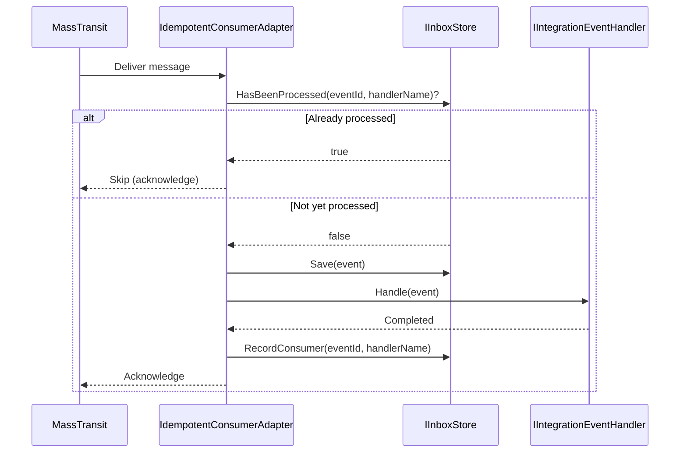
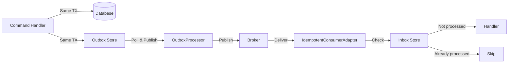

# Inbox Pattern

The inbox pattern ensures **idempotent message consumption** -- even if the same message is delivered more than once, your handlers process it only once. Modulus provides a built-in inbox implementation that automatically wraps every `IIntegrationEventHandler<T>` with deduplication logic.

## The Problem

Message brokers guarantee **at-least-once delivery**, not exactly-once. Duplicate messages occur in several scenarios:

- **Network retries:** The broker delivers a message, but the consumer's acknowledgment is lost. The broker re-delivers.
- **Outbox re-publishing:** The [OutboxProcessor](./outbox-pattern) published a message but crashed before marking it as processed. On restart, it publishes the same message again.
- **Broker failover:** During broker cluster failover, messages in flight may be re-queued.
- **Consumer timeout:** The consumer takes too long to process a message. The broker assumes it failed and re-delivers.

Without deduplication, a handler that processes a payment, sends an email, or updates inventory could execute these side effects multiple times.

## How It Works

Modulus solves this with the `IdempotentConsumerAdapter<TEvent>`, which transparently wraps every integration event handler. The adapter checks an inbox store to determine whether a message has already been processed before invoking the handler.



### Processing Flow

The `IdempotentConsumerAdapter<TEvent>` follows this logic for each incoming message:

1. **No inbox registered:** If no `IInboxStore` is registered in the DI container, the adapter falls through to direct handler execution. The inbox is entirely optional.
2. **Inbox registered:**
   1. **Save the event** to the inbox store (records that this message arrived).
   2. **Check `HasBeenProcessed(eventId, handlerName)`** -- has this specific handler already processed this specific event?
   3. If **already processed** -- skip the handler and acknowledge the message.
   4. If **not yet processed** -- invoke the handler, then call `RecordConsumer(eventId, handlerName)` to mark it as processed.

::: info Per-handler deduplication
The inbox tracks processing at the `(eventId, handlerName)` level. If an event has three handlers, each handler is independently tracked. Handler A being marked as processed does not affect whether Handler B or Handler C runs.
:::

## IInboxStore Interface

The `IInboxStore` interface defines the contract for inbox persistence:

```csharp
public interface IInboxStore
{
    Task Save(IIntegrationEvent @event);

    Task<IReadOnlyList<InboxMessage>> GetPending(int batchSize);

    Task MarkAsProcessed(IEnumerable<Guid> ids);

    Task<bool> HasBeenProcessed(Guid messageId, string handlerName);

    Task RecordConsumer(Guid messageId, string handlerName);
}
```

| Method | Description |
|---|---|
| `Save` | Persists the incoming event as an `InboxMessage`. |
| `GetPending` | Retrieves unprocessed inbox messages (used for reprocessing scenarios). |
| `MarkAsProcessed` | Marks inbox messages as fully processed. |
| `HasBeenProcessed` | Checks if a specific handler has already processed a specific message. |
| `RecordConsumer` | Records that a specific handler has processed a specific message. |

## InboxMessage Model

Each incoming event is stored as an `InboxMessage`:

```csharp
public class InboxMessage
{
    public Guid Id { get; set; }
    public string Type { get; set; }
    public string Content { get; set; }
    public DateTime OccurredOnUtc { get; set; }
    public DateTime? ProcessedOnUtc { get; set; }
}
```

| Property | Type | Description |
|---|---|---|
| `Id` | `Guid` | The `EventId` from the integration event. Used as the deduplication key. |
| `Type` | `string` | Assembly-qualified type name of the event. |
| `Content` | `string` | JSON-serialized event payload. |
| `OccurredOnUtc` | `DateTime` | When the original event was raised. |
| `ProcessedOnUtc` | `DateTime?` | When all handlers for this message completed. `null` while pending. |

## InboxMessageConsumer Model

Per-handler tracking is stored in the `InboxMessageConsumer` table with a composite primary key:

```csharp
public class InboxMessageConsumer
{
    public Guid InboxMessageId { get; set; }
    public string Name { get; set; }
}
```

| Property | Type | Description |
|---|---|---|
| `InboxMessageId` | `Guid` | Foreign key to the `InboxMessage`. |
| `Name` | `string` | The fully qualified name of the handler type. |

The composite key `(InboxMessageId, Name)` ensures that each handler is recorded exactly once per message. If two threads attempt to record the same consumer simultaneously, the database constraint prevents duplicates.

## IdempotentConsumerAdapter

The `IdempotentConsumerAdapter<TEvent>` is a MassTransit `IConsumer<TEvent>` wrapper that Modulus registers automatically for every `IIntegrationEventHandler<TEvent>` discovered during assembly scanning.

**You do not need to create or register this adapter.** It is applied transparently by `AddModulusMessaging`.

### Behavior Summary

```csharp
// Simplified pseudocode of IdempotentConsumerAdapter<TEvent>
public async Task Consume(ConsumeContext<TEvent> context)
{
    var @event = context.Message;

    // No inbox? Fall through to direct execution
    if (_inboxStore is null)
    {
        await _handler.Handle(@event, context.CancellationToken);
        return;
    }

    // Save the event to the inbox
    await _inboxStore.Save(@event);

    // Check if this handler already processed this event
    if (await _inboxStore.HasBeenProcessed(@event.EventId, _handlerName))
    {
        // Already processed -- skip
        return;
    }

    // Process the event
    await _handler.Handle(@event, context.CancellationToken);

    // Record that this handler has processed this event
    await _inboxStore.RecordConsumer(@event.EventId, _handlerName);
}
```

::: tip The inbox is optional
If you do not register an `IInboxStore` in the DI container, the `IdempotentConsumerAdapter` simply delegates to the handler directly. No deduplication occurs. This lets you opt in to the inbox pattern only when you need it.
:::

## EfInboxStore

The `EfInboxStore` is the built-in Entity Framework Core implementation of `IInboxStore`. It handles concurrent insert race conditions gracefully -- if two threads attempt to save the same inbox message simultaneously, the second insert is caught and ignored rather than throwing an exception.

### Handling Concurrent Inserts

When the same message arrives on two threads simultaneously:

1. Thread A calls `Save(@event)` -- inserts successfully.
2. Thread B calls `Save(@event)` -- catches the duplicate key violation and ignores it.
3. Both threads call `HasBeenProcessed` -- only one returns `false` first.
4. The winning thread processes the event and calls `RecordConsumer`.
5. The losing thread sees `HasBeenProcessed` return `true` and skips.

This race-safe behavior ensures correctness without requiring distributed locks.

## Usage Example

To enable the inbox pattern, register an `IInboxStore` implementation in your DI container:

```csharp
// Register the EF Core inbox store
builder.Services.AddScoped<IInboxStore, EfInboxStore>();
```

That is all. The `IdempotentConsumerAdapter` detects the registered `IInboxStore` and activates deduplication for all handlers automatically.

Your handler code does not change at all:

```csharp
public sealed class ReserveInventoryHandler
    : IIntegrationEventHandler<OrderCreatedEvent>
{
    private readonly IInventoryService _inventoryService;

    public ReserveInventoryHandler(IInventoryService inventoryService)
    {
        _inventoryService = inventoryService;
    }

    public async Task Handle(
        OrderCreatedEvent @event,
        CancellationToken cancellationToken)
    {
        // This handler will only execute once per event, even if
        // the message is delivered multiple times by the broker.
        await _inventoryService.ReserveAsync(
            @event.OrderId,
            @event.Items,
            cancellationToken);
    }
}
```

::: warning Ensure your DbContext includes inbox entities
Your `DbContext` must include `DbSet<InboxMessage>` and `DbSet<InboxMessageConsumer>` entity configurations for the `EfInboxStore` to function. Ensure the corresponding tables exist in your database via EF Core migrations.
:::

## Outbox + Inbox: End-to-End Reliability

The outbox and inbox patterns complement each other to provide reliable end-to-end message delivery:



| Layer | Pattern | Guarantee |
|---|---|---|
| **Publisher side** | Outbox | Messages are persisted atomically with domain changes and published at least once. |
| **Consumer side** | Inbox | Messages are processed exactly once per handler, regardless of how many times they are delivered. |

Together, they provide **effectively exactly-once processing**:
- The outbox ensures no messages are lost.
- The inbox ensures no messages are processed more than once.

## Best Practices

- **Always pair outbox with inbox.** The outbox guarantees at-least-once publishing, which means duplicates will occur. The inbox ensures each handler processes each message only once.
- **Include inbox tables in your migrations.** The `InboxMessage` and `InboxMessageConsumer` tables must exist in your database. Run EF Core migrations to create them.
- **Monitor the inbox table.** Like the outbox, the inbox table grows over time. Implement a cleanup job to remove old processed entries.
- **Keep handlers idempotent where possible.** Even with the inbox pattern, designing naturally idempotent handlers (e.g., upserts instead of inserts) adds an extra layer of safety.
- **Do not rely solely on the inbox for correctness.** The inbox is a safety net. Design your system to be resilient to duplicate processing at the domain level as well.

## See Also

- [Overview](./index) -- Messaging setup and `MessagingOptions`
- [Integration Events](./integration-events) -- Define events and handlers
- [Outbox Pattern](./outbox-pattern) -- Reliable message publishing
- [Message Bus](./message-bus) -- The `IMessageBus` API
