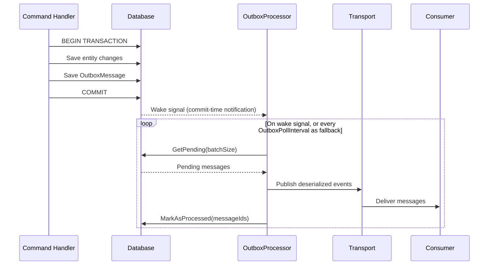
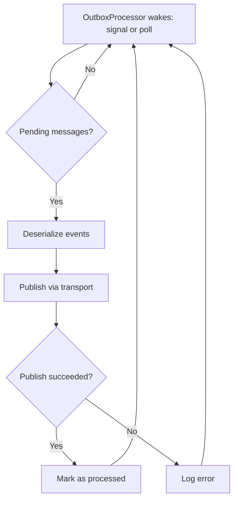

# Outbox Pattern

The transactional outbox pattern solves the **dual-write problem** -- the challenge of atomically updating your database and publishing a message to a broker. Modulus provides a built-in outbox implementation that saves messages to your database within the same transaction as your domain changes, then reliably publishes them to the broker via a background processor.

## The Problem

Consider a command handler that saves an order and publishes an event:

```csharp
// Danger: two separate operations that can partially fail
await _orderRepository.AddAsync(order, ct);          // 1. Write to database
await _messageBus.Publish(new OrderCreatedEvent(...), ct);  // 2. Publish to broker
```

Several failure scenarios can occur:

1. **Database succeeds, broker fails** -- The order is saved but the event is never published. Other modules never learn about the order.
2. **Broker succeeds, database fails** -- The event is published but the order is not saved. Consumers process a phantom event.
3. **Broker is temporarily unavailable** -- The entire operation fails even though the database write was valid.

The outbox pattern eliminates these issues by writing the event to the same database in the same transaction as the domain change.

## How It Works



1. **Command handler** saves the domain entity and an `OutboxMessage` in the **same database transaction**.
2. The transaction commits atomically -- either both the entity and the outbox message are saved, or neither is.
3. The commit **wakes the OutboxProcessor immediately** via a change notification (see [Immediate Dispatch](#immediate-dispatch-change-notification)); a configurable polling sweep remains as the fallback for anything the signal cannot see.
4. For each batch, it deserializes the events and publishes them through the configured transport.
5. After successful publishing, the messages are marked as processed.

## IOutboxStore Interface

The `IOutboxStore` interface defines the contract for outbox persistence:

<!-- verify -->
```csharp
public interface IOutboxStore
{
    Task Save(IIntegrationEvent @event, CancellationToken cancellationToken = default);
    Task<IReadOnlyList<OutboxMessage>> GetPending(int batchSize, int maxAttempts, CancellationToken cancellationToken = default);
    Task<int> CountPending(int maxAttempts, CancellationToken cancellationToken = default);
    Task MarkAsProcessed(IEnumerable<Guid> ids, CancellationToken cancellationToken = default);
    Task MarkAsFailed(Guid messageId, string error, CancellationToken cancellationToken = default);
}
```

| Method | Description |
|---|---|
| `Save` | Serializes and saves an integration event as an `OutboxMessage`. |
| `GetPending` | Retrieves up to `batchSize` unprocessed messages whose attempt count is below `maxAttempts`, ordered by creation time. Dead-lettered rows are excluded so they do not starve newer rows. |
| `CountPending` | Counts the same population `GetPending` draws from. Used by the backlog-depth health check. |
| `MarkAsProcessed` | Marks the specified messages as processed so they are not picked up again. |
| `MarkAsFailed` | Increments a message's attempt counter and records the failure message. |

## OutboxMessage Model

Each outbox entry is stored as an `OutboxMessage`:

<!-- verify -->
```csharp
public sealed class OutboxMessage
{
    public required Guid Id { get; init; }
    public required string EventType { get; init; }
    public required string Payload { get; init; }
    public required DateTime CreatedAt { get; init; }
    public DateTime? ProcessedAt { get; set; }
    public int Attempts { get; set; }
    public string? LastError { get; set; }
}
```

| Property | Type | Description |
|---|---|---|
| `Id` | `Guid` | Unique identifier for the outbox entry. |
| `EventType` | `string` | Assembly-qualified type name of the event, used for deserialization. |
| `Payload` | `string` | JSON-serialized event data. |
| `CreatedAt` | `DateTime` | When the outbox message was created. |
| `ProcessedAt` | `DateTime?` | When the message was successfully published. `null` while pending. |
| `Attempts` | `int` | Number of failed publish attempts. Once it reaches `RetryPolicy.MaxAttempts` the message is dead-lettered. |
| `LastError` | `string?` | Error message from the most recent failed publish attempt. |

## EfOutboxStore

The `EfOutboxStore` is the built-in Entity Framework Core implementation of `IOutboxStore`. It uses your application's `DbContext` to persist outbox messages, which means the outbox write participates in the same EF Core transaction as your domain entity changes.

```csharp
// The EfOutboxStore is registered automatically when you configure EF Core
// with your DbContext. Just ensure your DbContext includes the OutboxMessage entity.
```

::: info Same DbContext, same transaction
Because `EfOutboxStore` operates on the same `DbContext` as your repositories, calling `Save` on the outbox store and calling `SaveChangesAsync` on the `DbContext` are part of the same transaction. This is the key guarantee that makes the outbox pattern work.
:::

## OutboxProcessor

The `OutboxProcessor` is a `BackgroundService` that runs continuously in your application. It dispatches pending events as soon as a wake signal arrives (or the poll interval elapses), deserializes them, publishes them through the configured transport, and marks them as processed.

**Processing flow (drain-then-wait):**

1. Call `IOutboxStore.GetPending(batchSize)` to retrieve up to `OutboxBatchSize` (default: 100) pending messages.
2. For each message, deserialize the `Payload` using the `EventType` to resolve the concrete type.
3. Publish each deserialized event through the configured transport. On RabbitMQ, publisher confirmations are enabled, so a publish only counts as successful once the broker confirms it.
4. Call `IOutboxStore.MarkAsProcessed(ids)` for all successfully published messages.
5. If the fetch returned a **full batch**, more rows are probably waiting -- dispatch again immediately.
6. Otherwise wait until either a **wake signal** arrives (new rows committed -- dispatch immediately) or `OutboxPollInterval` (default: 5 seconds) elapses as the fallback sweep. Repeat.

### Configuration

Control the polling interval and batch size through `MessagingOptions`:

<!-- verify -->
```csharp
builder.Services.AddModulusRabbitMqTransport();
builder.Services.AddModulusMessaging(options =>
{
    options.Transport = Transport.RabbitMq;
    options.ConnectionString = builder.Configuration.GetConnectionString("RabbitMq");
    options.Assemblies.Add(typeof(Program).Assembly);

    // Outbox configuration
    options.OutboxPollInterval = TimeSpan.FromSeconds(10); // Default: 5 seconds
    options.OutboxBatchSize = 50;                          // Default: 100
});
```

| Option | Default | Description |
|---|---|---|
| `OutboxPollInterval` | `5 seconds` | Fallback sweep frequency. Rows saved through wired-up contexts are dispatched immediately via the wake signal, so this only bounds latency for rows the signal cannot see (other replicas, external writers, non-EF transactions). Minimum: 1 second. Raising it (e.g. to 30 seconds) reduces idle database load without adding dispatch latency for signaled rows. |
| `OutboxBatchSize` | `100` | Maximum messages processed per cycle. Valid range: 1–1000. Tune based on your throughput requirements. |

## Immediate Dispatch (Change Notification)

Polling alone means a new outbox row waits up to `OutboxPollInterval` before it is published. Modulus removes that latency with an in-process wake signal: the moment committed outbox rows become visible, the `OutboxProcessor` is notified and dispatches them immediately -- typically within milliseconds. The polling sweep stays on as the correctness fallback, so nothing is ever lost if a signal is missed.

There are three wake sources, and two of them are wired up for you:

1. **`IOutboxStore.Save`** signals after a successful save outside a transaction.
2. **`OutboxNotifyingInterceptor`** -- an EF Core interceptor that watches for `OutboxMessage` inserts and signals when they become visible. Inside an EF-managed transaction it defers the signal to **commit time** (a rolled-back transaction never signals). `AddModulusOutbox` attaches it to the library's `OutboxDbContext` automatically, and CLI-scaffolded module DbContexts come pre-wired. For your own DbContext that maps the outbox table:

<!-- verify -->
```csharp
using Modulus.Messaging.Outbox;

public static class OutboxInterceptorSetup
{
    public static IServiceCollection AddAppDbContext(this IServiceCollection services, string connectionString)
        => services.AddDbContext<DbContext>((sp, options) =>
        {
            options.UseSqlServer(connectionString);
            options.AddInterceptors(sp.GetRequiredService<OutboxNotifyingInterceptor>());
        });
}
```

3. **`IOutboxNotifier`** -- the signal itself, registered as a singleton. This is also the extension point for external change-data-capture listeners: anything that learns about new rows can inject it and call `Notify()`. For example, a PostgreSQL `LISTEN/NOTIFY` hosted service:

<!-- verify -->
```csharp
using Modulus.Messaging.Outbox;

public sealed class PostgresOutboxListener(IOutboxNotifier notifier) : BackgroundService
{
    protected override async Task ExecuteAsync(CancellationToken stoppingToken)
    {
        // await connection.ExecuteAsync("LISTEN modulus_outbox;") ... then per notification:
        notifier.Notify();
        await Task.CompletedTask;
    }
}
```

`Notify()` coalesces -- any number of calls while a dispatch pass is running results in a single follow-up pass -- and never blocks or throws.

::: warning The signal is in-process
Only the application instance that wrote the row is woken. Other replicas, dedicated worker deployments where a different process runs the outbox, external writers, and transactions EF Core does not observe (an externally-owned transaction passed to `Database.UseTransaction`, or an ambient `TransactionScope`) all fall back to the `OutboxPollInterval` sweep. Delivery guarantees are unchanged in every case -- the signal only removes latency, it never carries correctness.
:::

The `modulus.messaging.outbox.wakeups` metric (tag `reason`: `signal` / `poll` / `backlog`) shows whether wake signals are actually arriving in a deployment or the processor is effectively poll-only -- see the [OpenTelemetry recipe](../recipes/opentelemetry).

## Usage Example

The typical pattern is to save your domain entities and write to the outbox within the same unit of work:

```csharp
public sealed class PlaceOrderCommandHandler
    : ICommandHandler<PlaceOrderCommand, Guid>
{
    private readonly IOrderRepository _orderRepository;
    private readonly IOutboxStore _outboxStore;
    private readonly IUnitOfWork _unitOfWork;

    public PlaceOrderCommandHandler(
        IOrderRepository orderRepository,
        IOutboxStore outboxStore,
        IUnitOfWork unitOfWork)
    {
        _orderRepository = orderRepository;
        _outboxStore = outboxStore;
        _unitOfWork = unitOfWork;
    }

    public async Task<Result<Guid>> Handle(
        PlaceOrderCommand command,
        CancellationToken cancellationToken)
    {
        var order = new Order(command.CustomerId, command.Items);

        // 1. Save the order
        await _orderRepository.AddAsync(order, cancellationToken);

        // 2. Save the integration event to the outbox (same DbContext)
        await _outboxStore.Save(
            new OrderCreatedEvent(
                order.Id,
                command.CustomerId,
                order.Total,
                order.Items.Select(i =>
                    new OrderItemDto(i.ProductId, i.Quantity)).ToList()));

        // 3. Commit both in a single transaction
        await _unitOfWork.SaveChangesAsync(cancellationToken);

        // The OutboxProcessor will pick up the event and publish it
        return order.Id;
    }
}
```

::: warning Do not publish directly when using the outbox
When using the outbox pattern, save events to the outbox store instead of calling `IMessageBus.Publish()` directly. Calling `Publish` directly bypasses the outbox and reintroduces the dual-write problem.
:::

## How the OutboxProcessor Recovers from Failures

The outbox pattern is inherently resilient:

- **Broker unavailable:** The `OutboxProcessor` catches publish failures and retries on the next polling cycle. Messages remain in the outbox until successfully published.
- **Application crash after commit:** The outbox messages are persisted in the database. When the application restarts, the `OutboxProcessor` picks up where it left off.
- **Application crash before commit:** The transaction rolls back. Neither the domain entity nor the outbox message is persisted, which is the correct behavior.
- **Duplicate publishing:** If the application crashes after publishing but before marking messages as processed, the same messages may be published again on the next cycle. Use the [Inbox Pattern](./inbox-pattern) on the consumer side to handle this.



## Best Practices

- **Always save to the outbox within the same transaction as your domain changes.** This is the entire point of the pattern. If you save the outbox message in a separate transaction, you lose the atomicity guarantee.
- **Treat `OutboxPollInterval` as a fallback, not the latency knob.** Rows saved through wired-up contexts dispatch immediately via the wake signal, so a longer interval (e.g. 30 seconds) cuts idle database queries without slowing delivery. Keep it short only when signals cannot reach the processor (multi-replica or dedicated-worker topologies).
- **Monitor the outbox table.** If `ProcessedAt` is `null` for a large number of old messages, the processor may be failing silently. Set up alerts for outbox backlog.
- **Pair with the inbox pattern.** The outbox guarantees at-least-once publishing. Use the [Inbox Pattern](./inbox-pattern) on the consumer side to achieve exactly-once processing.
- **Clean up processed messages.** Over time, the outbox table grows. Implement a periodic job to delete or archive messages where `ProcessedAt` is not null and older than a retention period.

## See Also

- [Overview](./index) -- Messaging setup and `MessagingOptions`
- [Integration Events](./integration-events) -- Define events and handlers
- [Message Bus](./message-bus) -- The `IMessageBus` API
- [Inbox Pattern](./inbox-pattern) -- Idempotent consumption to complement the outbox
