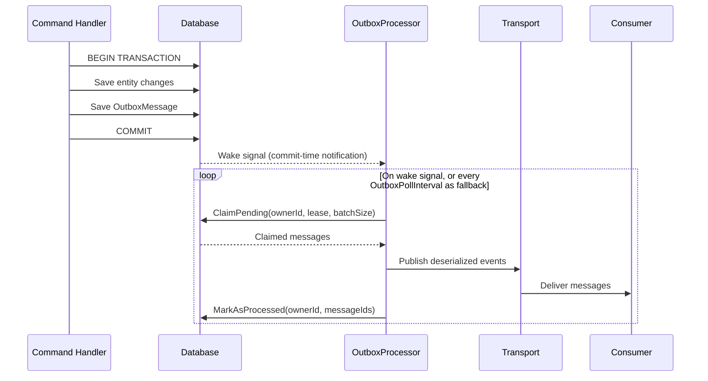
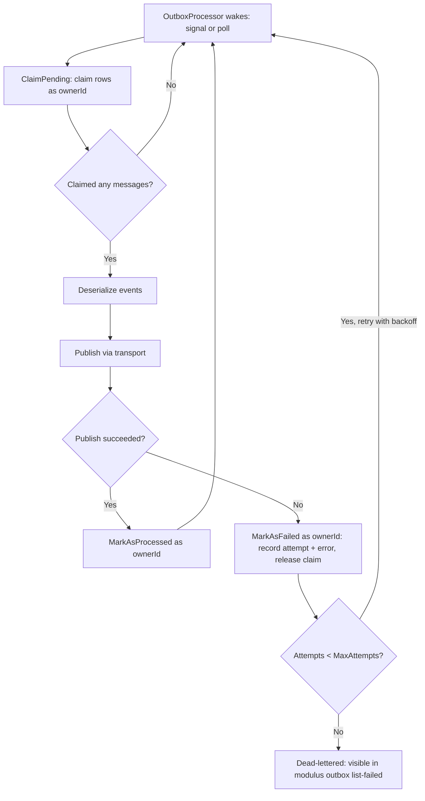

# Outbox Pattern

The transactional outbox pattern solves the **dual-write problem** -- the challenge of atomically updating your database and publishing a message to a broker. Modulus provides a built-in outbox implementation that saves messages as database rows, then reliably publishes them to the broker via a background processor. How atomic the save is with your business data depends on which of the two supported configurations you use -- see [Transactionality: the two configurations](#transactionality-the-two-configurations) below.

## The Problem

Consider a command handler that saves an order and publishes an event:

```csharp
// Danger: two separate operations that can partially fail
await _orderRepository.AddAsync(order, ct);          // 1. Write to database
await _messageBus.Publish(new OrderCreatedEvent(...), ct);  // 2. Publish to broker
```

Several failure scenarios can occur:

1. **Database succeeds, broker fails** -- The order is saved but the event is never published. Other modules never learn about the order.
2. **Broker succeeds, database fails** -- The event is published but the order is not saved. Consumers process a phantom event.
3. **Broker is temporarily unavailable** -- The entire operation fails even though the database write was valid.

The outbox pattern eliminates these issues by writing the event to the database as a row, decoupling the broker publish from the request path. With the outbox table mapped into your application `DbContext` (the recommended configuration for strict atomicity), the row commits in the **same transaction** as the domain change.

## How It Works


```mermaid
sequenceDiagram
    participant Handler as Command Handler
    participant DB as Database
    participant Outbox as OutboxProcessor
    participant Bus as Transport
    participant Consumer as Consumer

    Handler->>DB: BEGIN TRANSACTION
    Handler->>DB: Save entity changes
    Handler->>DB: Save OutboxMessage
    Handler->>DB: COMMIT

    DB-->>Outbox: Wake signal (commit-time notification)

    loop On wake signal, or every OutboxPollInterval as fallback
        Outbox->>DB: ClaimPending(ownerId, lease, batchSize)
        DB-->>Outbox: Claimed messages
        Outbox->>Bus: Publish deserialized events
        Bus->>Consumer: Deliver messages
        Outbox->>DB: MarkAsProcessed(ownerId, messageIds)
    end
```

1. **Command handler** saves the domain entity and an `OutboxMessage` row. In the same-DbContext configuration shown in the diagram, both are part of one transaction; with the default standalone store, the outbox row commits separately (details [below](#transactionality-the-two-configurations)).
2. The transaction commits -- in the same-DbContext configuration, atomically: either both the entity and the outbox message are saved, or neither is.
3. The commit **wakes the OutboxProcessor immediately** via a change notification (see [Immediate Dispatch](#immediate-dispatch-change-notification)); a configurable polling sweep remains as the fallback for anything the signal cannot see.
4. For each batch, it deserializes the events and publishes them through the configured transport.
5. After successful publishing, the messages are marked as processed.

## IOutboxStore Interface

The `IOutboxStore` interface defines the contract for outbox persistence:

<!-- verify -->
```csharp
public interface IOutboxStore
{
    Task Save(IIntegrationEvent @event, CancellationToken cancellationToken = default);
    Task<IReadOnlyList<OutboxMessage>> ClaimPending(string ownerId, TimeSpan lease, int batchSize, int maxAttempts, CancellationToken cancellationToken = default);
    Task<int> CountPending(int maxAttempts, CancellationToken cancellationToken = default);
    Task MarkAsProcessed(string ownerId, IEnumerable<Guid> ids, CancellationToken cancellationToken = default);
    Task MarkAsFailed(string ownerId, Guid messageId, string error, DateTime? nextAttemptOnUtc, CancellationToken cancellationToken = default);
}
```

| Method | Description |
|---|---|
| `Save` | Serializes and saves an integration event as an `OutboxMessage`. |
| `ClaimPending` | Atomically claims up to `batchSize` unprocessed messages for `ownerId`, so concurrent dispatcher instances polling the same table never publish the same row twice (see [Multi-instance dispatch](#multi-instance-dispatch-the-claim-lease) below). Excludes dead-lettered rows, rows still serving out a retry backoff, and rows another owner currently holds a live claim on. |
| `CountPending` | Counts unprocessed, not-yet-dead-lettered messages. Used by the backlog-depth health check; intentionally includes rows currently in backoff **and** rows another instance has claimed but not yet published, so backlog depth reflects true outstanding work rather than just what the caller could claim right now. |
| `MarkAsProcessed` | Marks the specified messages as processed, but only the ones `ownerId` still holds the claim on — a row whose claim was taken over by another owner is silently left alone. |
| `MarkAsFailed` | Increments a message's attempt counter, records the failure message, sets `NextAttemptOnUtc` from the configured retry backoff (pass `null` for immediately-eligible), and releases the claim — but again, only if `ownerId` still holds it. |

::: warning BREAKING in 4.0.0
Prior to 4.0.0 this interface had a plain `GetPending(batchSize, maxAttempts)` and owner-less `MarkAsProcessed`/`MarkAsFailed` overloads. 4.0.0 replaces `GetPending` with `ClaimPending` and adds a required `ownerId` parameter to `MarkAsProcessed`/`MarkAsFailed`. Custom `IOutboxStore` implementations must update to the new signatures — see [Multi-instance dispatch](#multi-instance-dispatch-the-claim-lease) for the claim semantics they need to implement.
:::

## OutboxMessage Model

Each outbox entry is stored as an `OutboxMessage`:

<!-- verify -->
```csharp
public sealed class OutboxMessage
{
    public required Guid Id { get; init; }
    public required string EventType { get; init; }
    public required string Payload { get; init; }
    public required DateTime CreatedAt { get; init; }
    public DateTime? ProcessedAt { get; set; }
    public int Attempts { get; set; }
    public string? LastError { get; set; }
    public DateTime? NextAttemptOnUtc { get; set; }
    public string? ClaimedBy { get; set; }
    public DateTime? ClaimedUntil { get; set; }
}
```

| Property | Type | Description |
|---|---|---|
| `Id` | `Guid` | Unique identifier for the outbox entry. |
| `EventType` | `string` | Assembly-qualified type name of the event, used for deserialization. |
| `Payload` | `string` | JSON-serialized event data. |
| `CreatedAt` | `DateTime` | When the outbox message was created. |
| `ProcessedAt` | `DateTime?` | When the message was successfully published. `null` while pending. |
| `Attempts` | `int` | Number of failed publish attempts. Once it reaches `RetryPolicy.MaxAttempts` the message is dead-lettered. |
| `LastError` | `string?` | Error message from the most recent failed publish attempt. |
| `NextAttemptOnUtc` | `DateTime?` | When the row becomes eligible for another dispatch attempt (set from the retry backoff on failure). `null` if it never failed or is immediately eligible. |
| `ClaimedBy` | `string?` | The owner id of the dispatcher instance currently holding a claim on this row, or `null` if unclaimed. |
| `ClaimedUntil` | `DateTime?` | UTC time the current claim expires, or `null` if unclaimed. A row whose claim has expired is claimable by anyone, including the instance that let it lapse — this is 4.0.0's crash-recovery mechanism (see below). |

## EfOutboxStore

The `EfOutboxStore` is the built-in Entity Framework Core implementation of `IOutboxStore` (registered by `AddModulusMessaging`, alongside the `OutboxProcessor` hosted service). It persists outbox messages through the package's own `OutboxDbContext` -- **not** through your application `DbContext` -- and each `Save` call commits immediately with its own `SaveChangesAsync`.

```csharp
// Registers OutboxDbContext (with the wake-signal interceptor attached).
// EfOutboxStore and the OutboxProcessor are registered by AddModulusMessaging.
builder.Services.AddModulusOutbox(o =>
    o.UseSqlServer(builder.Configuration.GetConnectionString("Default")));
```

## Transactionality: The Two Configurations

### Default: standalone `OutboxDbContext` (two transactions)

Out of the box, `IOutboxStore.Save` commits through the messaging-owned `OutboxDbContext`, on its own connection, separately from your business `SaveChangesAsync`. You get durability and broker-outage resilience -- the row is on disk before any publish is attempted, and retries/dead-lettering apply -- but **not** atomicity with your business data. Two small failure windows exist:

- **Crash between the two saves.** If the process dies after your business transaction commits but before `outboxStore.Save` commits, the event is lost -- the state changed and no event ever records it.
- **Ghost event on rollback.** If `outboxStore.Save` runs first (or your business transaction later rolls back), the event is already committed -- and because `Save` signals the processor immediately, it can be on the wire within milliseconds -- describing a change that never happened.

For many workloads (notifications, cache invalidation, analytics) these windows are acceptable. For workflows where an event must exactly mirror a committed state change, use the same-transaction configuration below.

### Recommended for strict atomicity: map the outbox into your application DbContext

Map the `OutboxMessage` entity into your own `DbContext` and write outbox rows through it -- business rows and outbox rows then commit in **one** `SaveChanges`, in one database transaction. Solutions scaffolded by the CLI are already set up for this: `BaseDbContext` applies `OutboxConfiguration` (in `BuildingBlocks.Infrastructure`), so every module `DbContext` maps the outbox table, and module contexts come pre-wired with `OutboxNotifyingInterceptor`.

```csharp
// 1. Map the outbox entity into your DbContext (scaffolded BaseDbContext does this already).
protected override void OnModelCreating(ModelBuilder modelBuilder)
{
    base.OnModelCreating(modelBuilder);
    modelBuilder.ApplyConfiguration(new OutboxConfiguration());
}

// 2. Attach the wake-signal interceptor so committed rows dispatch immediately
//    (scaffolded module DbContexts do this already).
builder.Services.AddDbContext<OrdersDbContext>((sp, options) =>
{
    options.UseSqlServer(connectionString);
    var interceptor = sp.GetService<OutboxNotifyingInterceptor>();
    if (interceptor is not null)
        options.AddInterceptors(interceptor);
});

// 3. Point AddModulusOutbox at the same database so the processor reads
//    the rows your context writes.
builder.Services.AddModulusOutbox(o => o.UseSqlServer(connectionString));
```

Then write the outbox row through your own context instead of calling `IOutboxStore.Save`:

```csharp
public async Task<Result<Guid>> Handle(PlaceOrderCommand command, CancellationToken ct)
{
    var order = new Order(command.CustomerId, command.Items);
    _dbContext.Orders.Add(order);

    var @event = new OrderCreatedEvent(order.Id, command.CustomerId, order.Total);
    _dbContext.Set<OutboxMessage>().Add(new OutboxMessage
    {
        Id = @event.EventId,
        EventType = @event.GetType().AssemblyQualifiedName!,
        Payload = JsonSerializer.Serialize(@event, @event.GetType()),
        CreatedAt = @event.OccurredOn,
    });

    // One SaveChanges: order row and outbox row commit atomically, or neither does.
    await _dbContext.SaveChangesAsync(ct);
    return order.Id;
}
```

::: warning Same database, same table
The processor reads through `OutboxDbContext`, so your mapped entity must resolve to the same physical table: same database, same table name and schema. If your module `DbContext` calls `HasDefaultSchema(...)`, pin the outbox table's schema explicitly (e.g. `builder.ToTable("OutboxMessages")` in the configuration) so both contexts agree.
:::

## OutboxProcessor

The `OutboxProcessor` is a `BackgroundService` that runs continuously in your application. It dispatches pending events as soon as a wake signal arrives (or the poll interval elapses), deserializes them, publishes them through the configured transport, and marks them as processed.

**Processing flow (drain-then-wait):**

1. Call `IOutboxStore.ClaimPending(ownerId, lease, batchSize)` to atomically claim up to `OutboxBatchSize` (default: 100) pending messages for this dispatcher instance's own `ownerId` — see [Multi-instance dispatch](#multi-instance-dispatch-the-claim-lease) below for what "claim" means and why it exists.
2. For each message, deserialize the `Payload` using the `EventType` to resolve the concrete type. Rows that cannot be dispatched -- unknown event type or a payload that fails to deserialize -- are marked failed via `MarkAsFailed` rather than silently retried, so a poison row cannot wedge the head of the queue or starve newer rows.
3. Publish each deserialized event through the configured transport. On RabbitMQ, publisher confirmations are enabled, so a publish only counts as successful once the broker confirms it.
4. Call `IOutboxStore.MarkAsProcessed(ownerId, ids)` for all successfully published messages; failed publishes are recorded with `MarkAsFailed` (which also releases the claim) and retried with the configured `RetryPolicy` backoff until `MaxAttempts` dead-letters them.
5. If the fetch returned a **full batch**, more rows are probably waiting -- dispatch again immediately.
6. Otherwise wait until either a **wake signal** arrives (new rows committed -- dispatch immediately) or `OutboxPollInterval` (default: 5 seconds) elapses as the fallback sweep. Repeat.

### Configuration

Control the polling interval, batch size, and claim lease through `MessagingOptions`:

<!-- verify -->
```csharp
builder.Services.AddModulusRabbitMqTransport();
builder.Services.AddModulusMessaging(options =>
{
    options.Transport = Transport.RabbitMq;
    options.ConnectionString = builder.Configuration.GetConnectionString("RabbitMq");
    options.Assemblies.Add(typeof(Program).Assembly);

    // Outbox configuration
    options.OutboxPollInterval = TimeSpan.FromSeconds(10); // Default: 5 seconds
    options.OutboxBatchSize = 50;                          // Default: 100
    options.OutboxClaimLease = TimeSpan.FromMinutes(2);    // Default: 5 minutes
});
```

| Option | Default | Description |
|---|---|---|
| `OutboxPollInterval` | `5 seconds` | Fallback sweep frequency. Rows saved through wired-up contexts are dispatched immediately via the wake signal, so this only bounds latency for rows the signal cannot see (other replicas, external writers, non-EF transactions). Minimum: 1 second. Raising it (e.g. to 30 seconds) reduces idle database load without adding dispatch latency for signaled rows. |
| `OutboxBatchSize` | `100` | Maximum messages processed per cycle. Valid range: 1–1000. Tune based on your throughput requirements. |
| `OutboxClaimLease` | `5 minutes` | How long a `ClaimPending` claim is held before it becomes reclaimable by any dispatcher instance. Must be greater than `OutboxPollInterval` and at least 30 seconds. See [Multi-instance dispatch](#multi-instance-dispatch-the-claim-lease). |

## Immediate Dispatch (Change Notification)

Polling alone means a new outbox row waits up to `OutboxPollInterval` before it is published. Modulus removes that latency with an in-process wake signal: the moment committed outbox rows become visible, the `OutboxProcessor` is notified and dispatches them immediately -- typically within milliseconds. The polling sweep stays on as the correctness fallback, so nothing is ever lost if a signal is missed.

There are three wake sources, and two of them are wired up for you:

1. **`IOutboxStore.Save`** signals after a successful save outside a transaction.
2. **`OutboxNotifyingInterceptor`** -- an EF Core interceptor that watches for `OutboxMessage` inserts and signals when they become visible. Inside an EF-managed transaction it defers the signal to **commit time** (a rolled-back transaction never signals). `AddModulusOutbox` attaches it to the library's `OutboxDbContext` automatically, and CLI-scaffolded module DbContexts come pre-wired. For your own DbContext that maps the outbox table:

<!-- verify -->
```csharp
using Modulus.Messaging.Outbox;

public static class OutboxInterceptorSetup
{
    public static IServiceCollection AddAppDbContext(this IServiceCollection services, string connectionString)
        => services.AddDbContext<DbContext>((sp, options) =>
        {
            options.UseSqlServer(connectionString);
            options.AddInterceptors(sp.GetRequiredService<OutboxNotifyingInterceptor>());
        });
}
```

3. **`IOutboxNotifier`** -- the signal itself, registered as a singleton. This is also the extension point for external change-data-capture listeners: anything that learns about new rows can inject it and call `Notify()`. For example, a PostgreSQL `LISTEN/NOTIFY` hosted service:

<!-- verify -->
```csharp
using Modulus.Messaging.Outbox;

public sealed class PostgresOutboxListener(IOutboxNotifier notifier) : BackgroundService
{
    protected override async Task ExecuteAsync(CancellationToken stoppingToken)
    {
        // await connection.ExecuteAsync("LISTEN modulus_outbox;") ... then per notification:
        notifier.Notify();
        await Task.CompletedTask;
    }
}
```

`Notify()` coalesces -- any number of calls while a dispatch pass is running results in a single follow-up pass -- and never blocks or throws.

::: warning The signal is in-process
Only the application instance that wrote the row is woken. Other replicas, dedicated worker deployments where a different process runs the outbox, external writers, and transactions EF Core does not observe (an externally-owned transaction passed to `Database.UseTransaction`, or an ambient `TransactionScope`) all fall back to the `OutboxPollInterval` sweep. Delivery guarantees are unchanged in every case -- the signal only removes latency, it never carries correctness.
:::

::: tip Every replica can run the dispatcher
Prior to 4.0.0, processors that polled the same outbox table concurrently could each pick up and publish the same pending rows, so the docs recommended a single logical dispatcher. 4.0.0's claim lease (below) makes that recommendation obsolete: run `OutboxProcessor` on every replica.
:::

The `modulus.messaging.outbox.wakeups` metric (tag `reason`: `signal` / `poll` / `backlog`) shows whether wake signals are actually arriving in a deployment or the processor is effectively poll-only -- see the [OpenTelemetry recipe](../recipes/opentelemetry).

## Multi-Instance Dispatch (The Claim Lease)

Scaled-out deployments routinely run more than one process capable of dispatching the outbox -- multiple web replicas, a dedicated worker alongside them, or both. Before 4.0.0, `IOutboxStore` had no cross-instance coordination at all: `GetPending` was a plain fetch, so two processors polling the same table at the same time could -- and, at any real scale, eventually would -- both pick up and publish the same pending row. The workaround was operational discipline: run a single logical dispatcher and let every other replica only *write* outbox rows.

4.0.0 removes that constraint with a portable optimistic claim, `IOutboxStore.ClaimPending(ownerId, lease, batchSize, maxAttempts)`, built entirely on `ExecuteUpdateAsync` -- no `SELECT ... FOR UPDATE SKIP LOCKED`, no provider-specific row-locking hint, so the mechanism works identically on SQL Server, PostgreSQL, SQLite, or any other relational EF Core provider.

### How the claim works

Each `OutboxDispatcher` instance generates a stable owner id once per process (machine name plus a per-process GUID, so replicas sharing a host still get distinct owners) and reuses it for every dispatch pass it runs. A single `ClaimPending` call then does three things:

1. **Find candidates.** Select up to `batchSize` eligible row ids -- unprocessed, under `MaxAttempts`, past their retry backoff and schedule, and either unclaimed or past their `ClaimedUntil` lease -- ordered by `CreatedAt`.
2. **Claim atomically.** A single set-based `ExecuteUpdateAsync` stamps `(ClaimedBy, ClaimedUntil)` onto those ids, re-checking the same unclaimed-or-lease-expired condition against the *current* row state (not the step-1 snapshot). A competitor that claims one of those ids in the gap between steps 1 and 2 simply drops out of this update's matched rows -- this is what makes each row single-winner under concurrency, without needing a database-specific locking primitive.
3. **Fetch the winners.** Re-select only the rows this call's `ownerId` actually ended up owning.

`MarkAsProcessed` and `MarkAsFailed` both gained a required `ownerId` parameter for the same reason: each re-checks `ClaimedBy == ownerId` before writing, so a pass whose lease already expired and was taken over by another instance can't stamp `ProcessedAt` or increment `Attempts` on a row it no longer owns. `MarkAsFailed` additionally clears the claim on success, so a durably-recorded failure is immediately reclaimable once its retry backoff elapses -- it does not sit out the remainder of the lease first.

### Sizing `OutboxClaimLease`

`MessagingOptions.OutboxClaimLease` (default 5 minutes) must comfortably outlast a real dispatch pass: deserializing, publishing, and marking processed for up to `OutboxBatchSize` rows. Registration validates `OutboxClaimLease >= 30 seconds` and `OutboxClaimLease > OutboxPollInterval`, but those are floor checks, not a guarantee that your lease is long enough for your actual publish latency and batch size -- size it with real numbers from your deployment (the `modulus.messaging.outbox.wakeups` and publish-latency metrics help here).

### Crash recovery is lease expiry

A dispatcher instance that crashes (or is killed, or hangs) mid-pass leaves its claimed rows exactly where they are -- claimed, unprocessed. No operator step recovers them: once `ClaimedUntil` elapses, any instance, including the crashed one restarting, can claim and publish those rows on its very next pass. This is the direct replacement for the old "run a single logical dispatcher, and if it dies, restart it promptly" operational story -- now every replica is a peer, and a dead one's in-flight work self-heals on a timer.

### Still exactly-one-publisher-per-row, not exactly-once-delivery

The claim guarantees that, at any instant, at most one live lease exists on a given row -- not that the row is published exactly once, ever. If a pass runs long enough to outlive its own lease (the scenario `OutboxClaimLease` sizing exists to make vanishingly rare -- a stalled transport call, a GC pause, a genuinely oversized batch), a second instance can legitimately claim and publish the same row while the first is still mid-flight, unaware it already lost the race. That is not a defect in the claim; it is the same at-least-once guarantee the outbox has always made, now extended across instances instead of within one. Pair the outbox with the [inbox pattern](./inbox-pattern) for consumer-side deduplication regardless of how many dispatcher instances are running.

## Usage Example

With the default standalone store, the typical handler saves its domain entities and hands the event to `IOutboxStore`:

```csharp
public sealed class PlaceOrderCommandHandler
    : ICommandHandler<PlaceOrderCommand, Guid>
{
    private readonly IOrderRepository _orderRepository;
    private readonly IOutboxStore _outboxStore;
    private readonly IUnitOfWork _unitOfWork;

    public PlaceOrderCommandHandler(
        IOrderRepository orderRepository,
        IOutboxStore outboxStore,
        IUnitOfWork unitOfWork)
    {
        _orderRepository = orderRepository;
        _outboxStore = outboxStore;
        _unitOfWork = unitOfWork;
    }

    public async Task<Result<Guid>> Handle(
        PlaceOrderCommand command,
        CancellationToken cancellationToken)
    {
        var order = new Order(command.CustomerId, command.Items);

        // 1. Stage the order in the business DbContext
        await _orderRepository.AddAsync(order, cancellationToken);

        // 2. Commit the business transaction
        await _unitOfWork.SaveChangesAsync(cancellationToken);

        // 3. Save the integration event to the outbox. Note: the default store
        //    commits this through its own OutboxDbContext — a second transaction.
        //    See "Transactionality: The Two Configurations" for the failure windows
        //    this leaves open and for the single-transaction alternative.
        await _outboxStore.Save(
            new OrderCreatedEvent(
                order.Id,
                command.CustomerId,
                order.Total,
                order.Items.Select(i =>
                    new OrderItemDto(i.ProductId, i.Quantity)).ToList()),
            cancellationToken);

        // The OutboxProcessor will pick up the event and publish it
        return order.Id;
    }
}
```

For the strict single-transaction version of this handler -- adding the `OutboxMessage` row to your own `DbContext` and committing everything in one `SaveChanges` -- see [the same-transaction configuration](#recommended-for-strict-atomicity-map-the-outbox-into-your-application-dbcontext) above.

::: warning Do not publish directly when using the outbox
When using the outbox pattern, save events to the outbox store instead of calling `IMessageBus.Publish()` directly. Calling `Publish` directly bypasses the outbox and reintroduces the dual-write problem.
:::

## How the OutboxProcessor Recovers from Failures

The outbox pattern is inherently resilient:

- **Broker unavailable:** The `OutboxProcessor` catches publish failures, records them via `MarkAsFailed`, and retries with backoff on later cycles. Messages remain in the outbox until successfully published or dead-lettered after `RetryPolicy.MaxAttempts`.
- **Application crash after commit:** The outbox messages are persisted in the database. When the application restarts, the `OutboxProcessor` picks up where it left off.
- **Application crash before commit:** In the same-DbContext configuration, the transaction rolls back and neither the domain entity nor the outbox message is persisted -- the correct behavior. With the default standalone store, the two commits are independent, so a crash between them can lose the event (see [the failure windows](#default-standalone-outboxdbcontext-two-transactions)).
- **Instance crash mid-dispatch:** Since 4.0.0, rows in flight when a dispatcher instance dies stay claimed (see [Multi-Instance Dispatch](#multi-instance-dispatch-the-claim-lease)) until their `OutboxClaimLease` expires, at which point any instance -- including the crashed one restarting -- claims and retries them automatically. No operator step required, and this now applies uniformly whether it's the only dispatcher or one of many scaled-out replicas.
- **Duplicate publishing:** If a dispatcher crashes after publishing but before marking a message processed -- or a claim lease expires mid-pass and a second instance claims the same row before the first finishes -- the same message may be published again. Delivery is **at-least-once** by design, across one instance or many; use the [Inbox Pattern](./inbox-pattern) on the consumer side to deduplicate.


```mermaid
flowchart TD
    A[OutboxProcessor wakes: signal or poll] --> Z[ClaimPending: claim rows as ownerId]
    Z --> B{Claimed any messages?}
    B -->|No| A
    B -->|Yes| C[Deserialize events]
    C --> D[Publish via transport]
    D --> E{Publish succeeded?}
    E -->|Yes| F[MarkAsProcessed as ownerId]
    F --> A
    E -->|No| G[MarkAsFailed as ownerId: record attempt + error, release claim]
    G --> H{Attempts < MaxAttempts?}
    H -->|Yes, retry with backoff| A
    H -->|No| I[Dead-lettered: visible in modulus outbox list-failed]
```

## Scheduled Publishing

The scheduled `Save` overload gives delayed publishing the outbox's durability: the row commits with your business data and the processor simply refuses to dispatch it before it is due.

```csharp
// Publish OrderFollowUpDue no earlier than three days from now.
await outbox.Save(new OrderFollowUpDue(order.Id), DateTimeOffset.UtcNow.AddDays(3), ct);
```

The row's `ScheduledOnUtc` gates `ClaimPending`, and — deliberately — the backlog count: a message scheduled a week out is not outstanding work, so it never trips the backlog health check. Once due, the message dispatches like any other; precision is bounded by `OutboxPollInterval` (default 5 seconds). For sub-poll precision without durability, `IMessageBus.PublishScheduled` hands the delay to the broker instead — see [Message Bus](./message-bus#imessagebus-interface).

Custom `IOutboxStore` implementations opt in by overriding the scheduled `Save` overload (the default implementation throws `NotSupportedException`).

## Retention & Cleanup

Delivered rows accumulate forever unless something removes them, and an ever-growing `OutboxMessages` table slowly degrades the polling query. The built-in retention sweep bounds that growth:

```csharp
builder.Services.AddModulusMessaging(options =>
{
    options.Retention.Enabled = true;                              // opt-in; default off
    options.Retention.ProcessedOutboxAge = TimeSpan.FromDays(7);   // published rows kept 7 days
    options.Retention.InboxAge = TimeSpan.FromDays(7);             // inbox dedup window (see below)
    options.Retention.SweepInterval = TimeSpan.FromHours(1);       // how often the sweep runs
    options.Retention.PurgeBatchSize = 500;                        // rows per delete round trip
});
```

When enabled, a background service (`MessagingRetentionService`) runs every `SweepInterval` and deletes, in `PurgeBatchSize`-row batches until drained:

- **Outbox** — rows whose `ProcessedAt` is older than `ProcessedOutboxAge`. Unprocessed rows are **never** purged: pending and backing-off rows are undelivered work, and dead-lettered rows stay visible to `modulus outbox list-failed` until an operator retries or purges them.
- **Inbox** — rows older than `InboxAge` (see the warning in [Inbox Pattern § Retention](./inbox-pattern#retention) before shortening it).

Each sweep emits the `modulus.messaging.retention.purged` counter (tag `store`: `outbox`/`inbox`). Hosts that only register one of the two contexts get that store swept and the other skipped with a single warning.

For one-off or scripted cleanup — e.g. before enabling retention on an old deployment — use the bulk CLI command instead: [`modulus outbox purge-processed`](/cli/outbox), which previews the row count until you pass `--confirm`. Custom `IOutboxAdminStore` implementations can opt into both by overriding `CountProcessedAsync`/`PurgeProcessedAsync` (the default implementations throw `NotSupportedException`).

## Best Practices

- **For strict atomicity, save to the outbox within the same transaction as your domain changes.** That means the [same-DbContext configuration](#recommended-for-strict-atomicity-map-the-outbox-into-your-application-dbcontext): map `OutboxMessage` into your application `DbContext` and commit business rows and outbox rows in one `SaveChanges`. The default standalone store commits separately and leaves small crash/rollback windows -- know which configuration you are running.
- **Treat `OutboxPollInterval` as a fallback, not the latency knob.** Rows saved through wired-up contexts dispatch immediately via the wake signal, so a longer interval (e.g. 30 seconds) cuts idle database queries without slowing delivery. Keep it short only when signals cannot reach the processor (multi-replica or dedicated-worker topologies).
- **Monitor the outbox table.** If `ProcessedAt` is `null` for a large number of old messages, the processor may be failing silently. Set up alerts for outbox backlog.
- **Pair with the inbox pattern.** The outbox guarantees at-least-once publishing. Use the [Inbox Pattern](./inbox-pattern) on the consumer side to achieve exactly-once processing.
- **Clean up processed messages.** Over time, the outbox table grows. Enable `MessagingOptions.Retention` (see [Retention & Cleanup](#retention-cleanup)) or schedule `modulus outbox purge-processed` to age delivered rows out.
- **Size `OutboxClaimLease` for your real publish latency, not just the validation floor.** It only has to exceed `OutboxPollInterval` and 30 seconds to register; a lease that is merely valid but too short for your actual batch-publish time invites the exact race (a second instance claiming a still-in-flight row) it exists to make rare. See [Multi-Instance Dispatch](#multi-instance-dispatch-the-claim-lease).

## See Also

- [Overview](./index) -- Messaging setup and `MessagingOptions`
- [Integration Events](./integration-events) -- Define events and handlers
- [Message Bus](./message-bus) -- The `IMessageBus` API
- [Inbox Pattern](./inbox-pattern) -- Idempotent consumption to complement the outbox
