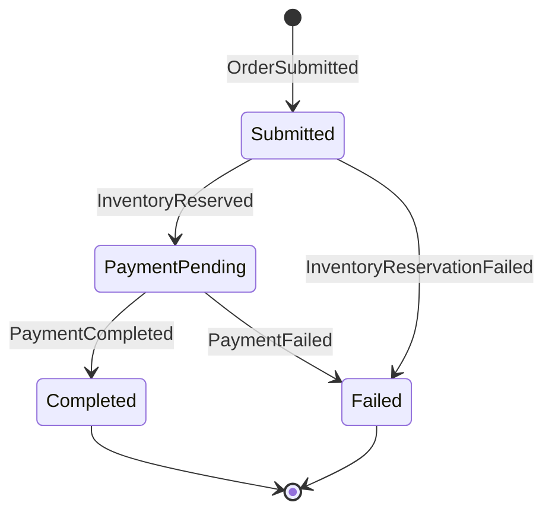

# Implementing Sagas

## Problem

Some business processes span multiple modules and require coordinated, multi-step workflows. For example, placing an order involves reserving inventory (Catalog module), processing payment (Payments module), and confirming the order (Orders module). If any step fails, the previous steps need to be compensated. Simple event-driven choreography becomes hard to manage as the number of steps grows.

## Solution

Implement a **process manager** (the orchestration flavor of the saga pattern) directly on the Modulus messaging abstractions. The recipe needs nothing beyond what you already have:

- A **state entity** persisted with EF Core that records where each workflow instance is
- One `IIntegrationEventHandler<TEvent>` per event that advances the workflow
- The **transactional outbox** to publish the next step's event atomically with the state change

Each handler does the same three things: load the state for the correlated instance, transition it, and save the follow-up event to the outbox **in the same database transaction**. The outbox guarantees the state change and the next message either both happen or neither does; the [inbox pattern](/messaging/inbox-pattern) guarantees a redelivered event does not advance the workflow twice.

::: tip No framework required
Earlier versions of this recipe used MassTransit state machines. The same workflow is expressed here as plain handlers and an EF-mapped state entity -- fewer concepts, no framework-specific saga types, and every step is testable like any other handler.
:::

### Step 1: Define the Workflow Events

Create the events that drive the saga. Place each event in the owning module's Integration project so other modules can subscribe to it:

```csharp
// Orders.Integration -- starts the workflow
public sealed record OrderSubmittedEvent(
    Guid OrderId,
    Guid CustomerId,
    decimal Total,
    List<OrderItemDto> Items) : IntegrationEvent;

// Orders.Integration -- steps requested by the process manager
public sealed record InventoryReservationRequestedEvent(
    Guid OrderId,
    List<OrderItemDto> Items) : IntegrationEvent;

public sealed record PaymentRequestedEvent(
    Guid OrderId,
    Guid CustomerId,
    decimal Total) : IntegrationEvent;

public sealed record OrderConfirmedEvent(Guid OrderId) : IntegrationEvent;

public sealed record OrderCancelledEvent(
    Guid OrderId,
    string Reason) : IntegrationEvent;

// Catalog.Integration -- outcomes reported back to the process manager
public sealed record InventoryReservedEvent(Guid OrderId) : IntegrationEvent;

public sealed record InventoryReservationFailedEvent(
    Guid OrderId,
    string Reason) : IntegrationEvent;

public sealed record InventoryReleaseRequestedEvent(Guid OrderId) : IntegrationEvent;

// Payments.Integration
public sealed record PaymentCompletedEvent(
    Guid OrderId,
    string TransactionId) : IntegrationEvent;

public sealed record PaymentFailedEvent(
    Guid OrderId,
    string Reason) : IntegrationEvent;
```

Deriving from the `IntegrationEvent` base record supplies `EventId`, `OccurredOn`, and `CorrelationId` automatically.

### Step 2: Define the Process State

Create an entity that represents one workflow instance, correlated by `OrderId`:

```csharp
namespace EShop.Modules.Orders.Infrastructure.Sagas;

public enum OrderSagaStatus
{
    Submitted,
    PaymentPending,
    Completed,
    Failed
}

public class OrderSagaState
{
    public Guid OrderId { get; private set; }
    public Guid CustomerId { get; private set; }
    public decimal Total { get; private set; }
    public OrderSagaStatus Status { get; private set; }

    // Payment data (populated when payment completes)
    public string? TransactionId { get; private set; }

    // Failure reason (populated on compensation)
    public string? FailureReason { get; private set; }

    private OrderSagaState() { } // EF Core

    public static OrderSagaState Start(Guid orderId, Guid customerId, decimal total) =>
        new()
        {
            OrderId = orderId,
            CustomerId = customerId,
            Total = total,
            Status = OrderSagaStatus.Submitted
        };

    public bool AwaitPayment()
    {
        if (Status != OrderSagaStatus.Submitted) return false;
        Status = OrderSagaStatus.PaymentPending;
        return true;
    }

    public bool Complete(string transactionId)
    {
        if (Status != OrderSagaStatus.PaymentPending) return false;
        Status = OrderSagaStatus.Completed;
        TransactionId = transactionId;
        return true;
    }

    public bool Fail(string reason)
    {
        if (Status is OrderSagaStatus.Completed or OrderSagaStatus.Failed) return false;
        Status = OrderSagaStatus.Failed;
        FailureReason = reason;
        return true;
    }
}
```

The transition methods return `false` when the event arrives in the wrong state (out-of-order or duplicate delivery), letting handlers skip stale transitions safely.

### Step 3: Map the State with EF Core

```csharp
using Microsoft.EntityFrameworkCore;
using Microsoft.EntityFrameworkCore.Metadata.Builders;

namespace EShop.Modules.Orders.Infrastructure.Sagas;

public class OrderSagaStateConfiguration : IEntityTypeConfiguration<OrderSagaState>
{
    public void Configure(EntityTypeBuilder<OrderSagaState> builder)
    {
        builder.ToTable("order_sagas", "orders");
        builder.HasKey(x => x.OrderId);

        builder.Property(x => x.Status).HasConversion<string>().HasMaxLength(64);
        builder.Property(x => x.Total).HasPrecision(18, 2);
        builder.Property(x => x.TransactionId).HasMaxLength(256);
        builder.Property(x => x.FailureReason).HasMaxLength(1000);
    }
}
```

Add `DbSet<OrderSagaState>` to the module's existing `DbContext` -- the state rides in the same database (and the same transaction) as the module's other data.

### Step 4: Implement the Transition Handlers

Each handler advances the workflow and hands the next event to the outbox within one `SaveChangesAsync`:

```csharp
using Modulus.Messaging.Abstractions;

namespace EShop.Modules.Orders.Infrastructure.Sagas;

public sealed class OrderSubmittedHandler(
    OrdersDbContext dbContext,
    IOutboxStore outbox) : IIntegrationEventHandler<OrderSubmittedEvent>
{
    public async Task Handle(OrderSubmittedEvent @event, CancellationToken cancellationToken)
    {
        var state = OrderSagaState.Start(@event.OrderId, @event.CustomerId, @event.Total);
        dbContext.Add(state);

        await outbox.Save(
            new InventoryReservationRequestedEvent(@event.OrderId, @event.Items),
            cancellationToken);

        await dbContext.SaveChangesAsync(cancellationToken);
    }
}

public sealed class InventoryReservedHandler(
    OrdersDbContext dbContext,
    IOutboxStore outbox) : IIntegrationEventHandler<InventoryReservedEvent>
{
    public async Task Handle(InventoryReservedEvent @event, CancellationToken cancellationToken)
    {
        var state = await dbContext.Set<OrderSagaState>()
            .FindAsync([@event.OrderId], cancellationToken);

        if (state is null || !state.AwaitPayment())
            return; // unknown instance or stale transition -- ignore

        await outbox.Save(
            new PaymentRequestedEvent(state.OrderId, state.CustomerId, state.Total),
            cancellationToken);

        await dbContext.SaveChangesAsync(cancellationToken);
    }
}

public sealed class PaymentCompletedHandler(
    OrdersDbContext dbContext,
    IOutboxStore outbox) : IIntegrationEventHandler<PaymentCompletedEvent>
{
    public async Task Handle(PaymentCompletedEvent @event, CancellationToken cancellationToken)
    {
        var state = await dbContext.Set<OrderSagaState>()
            .FindAsync([@event.OrderId], cancellationToken);

        if (state is null || !state.Complete(@event.TransactionId))
            return;

        await outbox.Save(new OrderConfirmedEvent(state.OrderId), cancellationToken);
        await dbContext.SaveChangesAsync(cancellationToken);
    }
}
```

Compensation follows the same shape -- on failure, the handler transitions to `Failed` and emits the compensating events:

```csharp
public sealed class PaymentFailedHandler(
    OrdersDbContext dbContext,
    IOutboxStore outbox) : IIntegrationEventHandler<PaymentFailedEvent>
{
    public async Task Handle(PaymentFailedEvent @event, CancellationToken cancellationToken)
    {
        var state = await dbContext.Set<OrderSagaState>()
            .FindAsync([@event.OrderId], cancellationToken);

        if (state is null || !state.Fail(@event.Reason))
            return;

        // Compensate: release the reserved inventory, cancel the order.
        await outbox.Save(new InventoryReleaseRequestedEvent(state.OrderId), cancellationToken);
        await outbox.Save(new OrderCancelledEvent(state.OrderId, @event.Reason), cancellationToken);

        await dbContext.SaveChangesAsync(cancellationToken);
    }
}
```

An `InventoryReservationFailedHandler` looks the same, minus the inventory release.

### Step 5: Registration

There is none. The handlers are discovered like any other `IIntegrationEventHandler<TEvent>` -- just make sure their assembly is in `MessagingOptions.Assemblies`:

```csharp
builder.Services.AddModulusMessaging(builder.Configuration, options =>
{
    options.Assemblies.Add(typeof(OrderSubmittedHandler).Assembly);
});
```

### Saga Flow Diagram



## Discussion

Sagas are appropriate when:

- A business process spans multiple modules or services
- Steps must be compensated on failure (the "saga pattern")
- You need visibility into the current state of long-running workflows
- Simple event choreography becomes too complex to reason about

Sagas are **not** needed for:

- Operations within a single module (use transactions and domain events instead)
- Simple fire-and-forget event publishing (use integration events)
- Workflows with no compensation requirements

### Why this works reliably

Three properties of the Modulus messaging stack combine to make the hand-rolled process manager safe:

1. **Atomic transitions.** State change and outgoing event are written in one transaction; the [outbox](/messaging/outbox-pattern) publishes the event afterwards with retries.
2. **Idempotent steps.** With the [inbox](/messaging/inbox-pattern) registered, a redelivered event does not re-run a handler that already succeeded. The guarded transition methods add a second layer of protection at the domain level.
3. **Ordered-enough delivery.** Events arriving out of order simply fail their state guard and are ignored; the workflow only ever moves forward.

### Saga vs Choreography

| Aspect | Choreography | Saga (Orchestration) |
|---|---|---|
| **Coordination** | Decentralized -- each module reacts to events | Centralized -- the process manager controls the flow |
| **Visibility** | Scattered across event handlers | One state table shows every workflow instance |
| **Compensation** | Each handler must know what to undo | The process manager defines compensation transitions |
| **Complexity** | Simpler for 2-3 step workflows | Better for 4+ step workflows with branching |

### Testing Sagas

Each transition is an ordinary handler, so it unit-tests like one -- no broker, no harness:

```csharp
[Fact]
public async Task InventoryReserved_SubmittedOrder_RequestsPayment()
{
    // Arrange
    await using var dbContext = CreateInMemoryOrdersDbContext();
    var outbox = new FakeOutboxStore();

    var orderId = Guid.NewGuid();
    dbContext.Add(OrderSagaState.Start(orderId, Guid.NewGuid(), 99.99m));
    await dbContext.SaveChangesAsync();

    var sut = new InventoryReservedHandler(dbContext, outbox);

    // Act
    await sut.Handle(new InventoryReservedEvent(orderId), CancellationToken.None);

    // Assert
    var state = await dbContext.Set<OrderSagaState>().FindAsync(orderId);
    state!.Status.ShouldBe(OrderSagaStatus.PaymentPending);
    outbox.Saved.OfType<PaymentRequestedEvent>().ShouldHaveSingleItem();
}
```

For end-to-end workflow tests, run the whole flow on the [InMemory transport](/messaging/transports#inmemory-transport) -- delivery is immediate, so no fixed delays are needed.

## See Also

- [Messaging Overview](/messaging/) -- The Modulus messaging stack
- [Integration Events](/messaging/integration-events) -- Events that trigger saga transitions
- [Outbox Pattern](/messaging/outbox-pattern) -- Atomic state-change-plus-publish
- [Inbox Pattern](/messaging/inbox-pattern) -- Idempotent transitions under redelivery
- [Transports](/messaging/transports) -- Configure the message broker for saga communication
