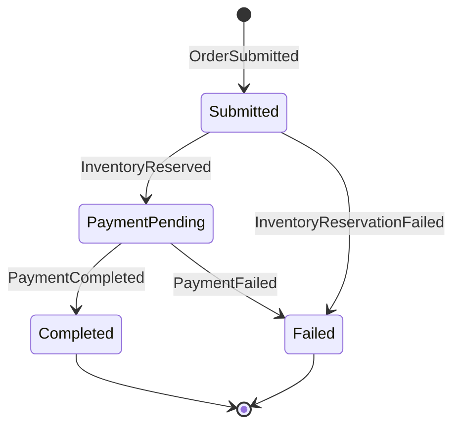

# Implementing Sagas

## Problem

Some business processes span multiple modules and require coordinated, multi-step workflows. For example, placing an order involves reserving inventory (Catalog module), processing payment (Payments module), and confirming the order (Orders module). If any step fails, the previous steps need to be compensated. Simple event-driven choreography becomes hard to manage as the number of steps grows.

## Solution

Use MassTransit state machines to implement sagas. Since Modulus.Messaging wraps MassTransit under the hood, you have full access to MassTransit's saga infrastructure, including state machines, persistence, and automatic retry.

::: warning Beyond the Modulus abstraction
Sagas are an advanced pattern that goes beyond the Modulus messaging abstraction layer. You will work directly with MassTransit types (`MassTransitStateMachine`, `SagaStateMachineInstance`, etc.). This is by design -- saga state machines are inherently complex and benefit from direct access to MassTransit's full API rather than a simplified wrapper.
:::

### Step 1: Install MassTransit Saga Packages

```bash
dotnet add src/Modules/Orders/EShop.Modules.Orders.Infrastructure/ \
    package MassTransit
dotnet add src/Modules/Orders/EShop.Modules.Orders.Infrastructure/ \
    package MassTransit.EntityFrameworkCore
```

### Step 2: Define Saga Events

Create the events that drive the saga. Place these in the Integration project so other modules can publish them:

```csharp
// Orders.Integration
public sealed record OrderSubmittedEvent(
    Guid OrderId,
    Guid CustomerId,
    decimal Total,
    List<OrderItemDto> Items) : IIntegrationEvent;

// Catalog.Integration
public sealed record InventoryReservedEvent(
    Guid OrderId) : IIntegrationEvent;

public sealed record InventoryReservationFailedEvent(
    Guid OrderId,
    string Reason) : IIntegrationEvent;

// Payments.Integration
public sealed record PaymentCompletedEvent(
    Guid OrderId,
    string TransactionId) : IIntegrationEvent;

public sealed record PaymentFailedEvent(
    Guid OrderId,
    string Reason) : IIntegrationEvent;
```

### Step 3: Define the Saga State

Create a class that represents the saga's persistent state:

```csharp
using MassTransit;

namespace EShop.Modules.Orders.Infrastructure.Sagas;

public class OrderSagaState : SagaStateMachineInstance
{
    public Guid CorrelationId { get; set; }
    public string CurrentState { get; set; } = default!;

    // Order data
    public Guid OrderId { get; set; }
    public Guid CustomerId { get; set; }
    public decimal Total { get; set; }

    // Payment data (populated when payment completes)
    public string? TransactionId { get; set; }

    // Failure reason (populated on compensation)
    public string? FailureReason { get; set; }
}
```

### Step 4: Define the State Machine

The state machine defines the saga's states, transitions, and compensation logic:

```csharp
using MassTransit;

namespace EShop.Modules.Orders.Infrastructure.Sagas;

public class OrderSaga : MassTransitStateMachine<OrderSagaState>
{
    // States
    public State Submitted { get; private set; } = null!;
    public State InventoryReserved { get; private set; } = null!;
    public State PaymentPending { get; private set; } = null!;
    public State Completed { get; private set; } = null!;
    public State Failed { get; private set; } = null!;

    // Events
    public Event<OrderSubmittedEvent> OrderSubmitted { get; private set; } = null!;
    public Event<InventoryReservedEvent> InventoryReserved { get; private set; } = null!;
    public Event<InventoryReservationFailedEvent> InventoryReservationFailed { get; private set; } = null!;
    public Event<PaymentCompletedEvent> PaymentCompleted { get; private set; } = null!;
    public Event<PaymentFailedEvent> PaymentFailed { get; private set; } = null!;

    public OrderSaga()
    {
        InstanceState(x => x.CurrentState);

        // Correlate all events by OrderId
        Event(() => OrderSubmitted, x => x.CorrelateById(ctx => ctx.Message.OrderId));
        Event(() => InventoryReserved, x => x.CorrelateById(ctx => ctx.Message.OrderId));
        Event(() => InventoryReservationFailed, x => x.CorrelateById(ctx => ctx.Message.OrderId));
        Event(() => PaymentCompleted, x => x.CorrelateById(ctx => ctx.Message.OrderId));
        Event(() => PaymentFailed, x => x.CorrelateById(ctx => ctx.Message.OrderId));

        // Initial state: waiting for order submission
        Initially(
            When(OrderSubmitted)
                .Then(ctx =>
                {
                    ctx.Saga.OrderId = ctx.Message.OrderId;
                    ctx.Saga.CustomerId = ctx.Message.CustomerId;
                    ctx.Saga.Total = ctx.Message.Total;
                })
                .TransitionTo(Submitted)
                .Publish(ctx => new ReserveInventoryCommand(
                    ctx.Saga.OrderId,
                    ctx.Message.Items))
        );

        // After submission: waiting for inventory reservation
        During(Submitted,
            When(InventoryReserved)
                .TransitionTo(PaymentPending)
                .Publish(ctx => new ProcessPaymentCommand(
                    ctx.Saga.OrderId,
                    ctx.Saga.CustomerId,
                    ctx.Saga.Total)),

            When(InventoryReservationFailed)
                .Then(ctx => ctx.Saga.FailureReason = ctx.Message.Reason)
                .TransitionTo(Failed)
                .Publish(ctx => new CancelOrderCommand(ctx.Saga.OrderId))
        );

        // After inventory reserved: waiting for payment
        During(PaymentPending,
            When(PaymentCompleted)
                .Then(ctx => ctx.Saga.TransactionId = ctx.Message.TransactionId)
                .TransitionTo(Completed)
                .Publish(ctx => new ConfirmOrderCommand(ctx.Saga.OrderId)),

            When(PaymentFailed)
                .Then(ctx => ctx.Saga.FailureReason = ctx.Message.Reason)
                .TransitionTo(Failed)
                .Publish(ctx => new ReleaseInventoryCommand(ctx.Saga.OrderId))
                .Publish(ctx => new CancelOrderCommand(ctx.Saga.OrderId))
        );

        // Terminal states
        SetCompletedWhenFinalized();
    }
}
```

### Step 5: Configure Saga Persistence with EF Core

Create an EF Core entity configuration for the saga state:

```csharp
using MassTransit.EntityFrameworkCoreIntegration;
using Microsoft.EntityFrameworkCore;
using Microsoft.EntityFrameworkCore.Metadata.Builders;

namespace EShop.Modules.Orders.Infrastructure.Sagas;

public class OrderSagaStateMap : SagaClassMap<OrderSagaState>
{
    protected override void Configure(
        EntityTypeBuilder<OrderSagaState> entity, ModelBuilder model)
    {
        entity.ToTable("order_sagas", "orders");

        entity.Property(x => x.CurrentState)
            .HasMaxLength(64)
            .IsRequired();

        entity.Property(x => x.OrderId);
        entity.Property(x => x.CustomerId);
        entity.Property(x => x.Total).HasPrecision(18, 2);
        entity.Property(x => x.TransactionId).HasMaxLength(256);
        entity.Property(x => x.FailureReason).HasMaxLength(1000);
    }
}
```

Create or extend a `DbContext` for saga persistence:

```csharp
public class OrdersSagaDbContext : SagaDbContext
{
    public OrdersSagaDbContext(DbContextOptions<OrdersSagaDbContext> options)
        : base(options) { }

    protected override IEnumerable<ISagaClassMap> Configurations
    {
        get { yield return new OrderSagaStateMap(); }
    }
}
```

### Step 6: Register the Saga

In the module registration:

```csharp
public void ConfigureServices(IServiceCollection services, IConfiguration configuration)
{
    // Register saga DbContext
    services.AddDbContext<OrdersSagaDbContext>(options =>
        options.UseNpgsql(configuration.GetConnectionString("Database")));

    // Register MassTransit with the saga
    services.AddMassTransit(cfg =>
    {
        cfg.AddSagaStateMachine<OrderSaga, OrderSagaState>()
            .EntityFrameworkRepository(r =>
            {
                r.ConcurrencyMode = ConcurrencyMode.Optimistic;
                r.ExistingDbContext<OrdersSagaDbContext>();
                r.UsePostgres();
            });
    });
}
```

### Saga Flow Diagram



## Discussion

Sagas are appropriate when:

- A business process spans multiple modules or services
- Steps must be compensated on failure (the "saga pattern")
- You need visibility into the current state of long-running workflows
- Simple event choreography becomes too complex to reason about

Sagas are **not** needed for:

- Operations within a single module (use transactions and domain events instead)
- Simple fire-and-forget event publishing (use integration events)
- Workflows with no compensation requirements

### Saga vs Choreography

| Aspect | Choreography | Saga (Orchestration) |
|---|---|---|
| **Coordination** | Decentralized -- each module reacts to events | Centralized -- the state machine controls the flow |
| **Visibility** | Scattered across event handlers | Single place to see the entire workflow |
| **Compensation** | Each handler must know what to undo | The state machine defines compensation transitions |
| **Complexity** | Simpler for 2-3 step workflows | Better for 4+ step workflows with branching |

### Testing Sagas

MassTransit provides a test harness for saga testing:

```csharp
[Fact]
public async Task OrderSubmitted_ReservesInventory()
{
    await using var provider = new ServiceCollection()
        .AddMassTransitTestHarness(cfg =>
        {
            cfg.AddSagaStateMachine<OrderSaga, OrderSagaState>()
                .InMemoryRepository();
        })
        .BuildServiceProvider(true);

    var harness = provider.GetRequiredService<ITestHarness>();
    await harness.Start();

    var orderId = Guid.NewGuid();

    await harness.Bus.Publish(new OrderSubmittedEvent(
        orderId, Guid.NewGuid(), 99.99m, []));

    var sagaHarness = harness.GetSagaStateMachineHarness<
        OrderSaga, OrderSagaState>();

    (await sagaHarness.Exists(orderId, s => s.Submitted))
        .HasValue.ShouldBeTrue();
}
```

## See Also

- [Messaging Overview](/messaging/) -- Modulus.Messaging and MassTransit integration
- [Integration Events](/messaging/integration-events) -- Events that trigger saga transitions
- [Transports](/messaging/transports) -- Configure the message broker for saga communication
